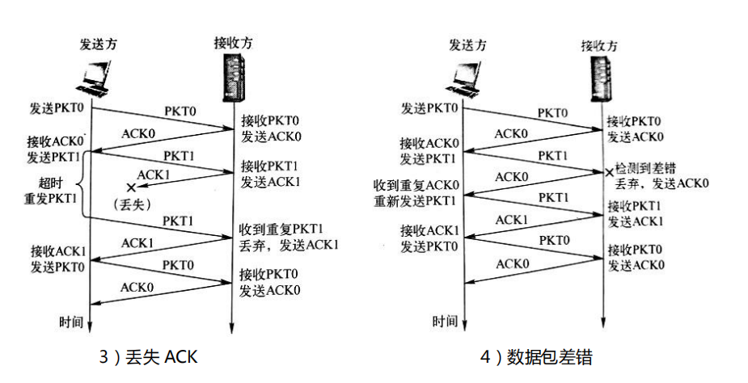

[toc]

## 一、不可靠数据传输的问题

不可靠传输信道在数据传输

中可能发生：

1. 比特差错。
2. 乱序。
3. 数据丢失。

## 二、可靠数据传输基本原理

- TCP 发送的报文段都是交给 IP传送的，IP 只能提供**尽力服务**。但网络应用希望传输层提供可靠的数据传输服务。

- TCP 必须采取**措施**，实现可靠数据传输。
  - **差错检测**：利用差错编码实现数据包传输过程中的比特差错检测。
  - **确认**：接收方向发送方反馈接收状态。ACK（肯定确认）；NAK（否定确认）。
  - **重传**：发送方重新发送接收方没有正确接收的数据。
  - **序号**：确保数据按序提交。

  - **计时器**：解决数据丢失问题。

## 三、可靠数据传输协议

### 1. 停-等协议

以只使用 ACK 的停-等协议为例，通过发送方与接收方的数据包发送与确认的交互时序图，展示停-等协议在典型情境下确保可靠传输。

PKT0 和 PKT1 分别表示序号位 0 和 1 的报文段；ACK0 和 ACK1 分别对报文段 PKT0 和 PKT1 的确认。

### 2. 滑动窗口协议

#### 2.1 滑动窗口协议工作原理

#### 2.2 两个典型的滑动窗口协议：GBN 协议和 SR 协议

