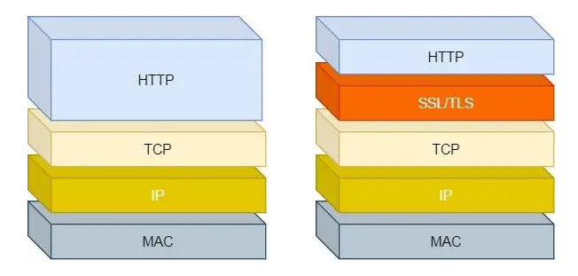
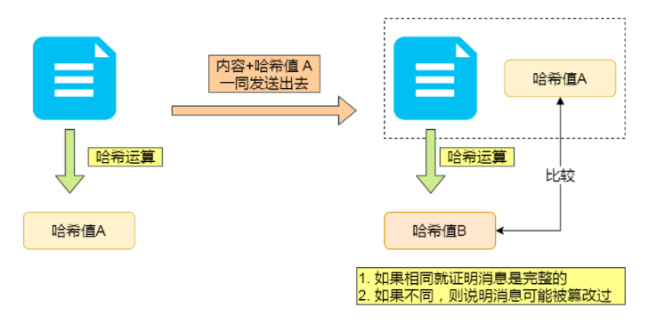
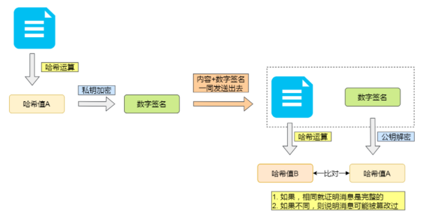

[toc]

### 1. HTTPS（HTTP SecureSocket Layer）

**Http**超⽂本传输协议，明⽂传输 ，传输不安全

**HTPPS**在传输数据的时候会使用**SSL协议**对数据进⾏加密

### 2. HTTPS和HTTP的主要区别

- HTTPS协议使⽤时需要到电⼦商务认证授权机构（CA）申请SSL证书

- HTTP默认使⽤8080端⼝，HTTPS默认使⽤8443端⼝

- HTTPS则是具有SSL加密的安全性传输协议，对数据的传输进⾏加密，效果上相当于HTTP的升级版

- HTTP的连接是⽆状态的，不安全的；HTTPS协议是由SSL+HTTP协议构建的可进⾏加密传输、身份认证的⽹络协议，⽐HTTP协议安全

### 3. HTTPS发展历程

为了解决 HTTP 协议的安全性，后面就出现了 HTTPS 协议，在 HTTP 层与 TCP 层之间加入了 TLS 协议，来保证安全可靠的信息传输。

具体怎么做到安全可靠的信息传输，这就涉及到了**数字签名和数字证书**。

#### V1.0

**使用Hash算法，对内容计算得到签名，保证传输的内容不被篡改**

对内容计算出一个「指纹」，然后同内容一起传输给对方。对方收到后，先是对内容也计算出一个「指纹」，然后跟发送方发送的「指纹」做一个比较，如果「指纹」相同，说明内容没有被篡改，否则就可以判断出内容被篡改了。

在计算机里会**用哈希函数来计算出内容的哈希值**，也就是内容的「指纹」，这个**内容的哈希值是唯一的，且无法通过哈希值推导出内容**。

存在风险：内容和指纹 可能被同时调包，无法保证数据是否来源服务端

#### V2.0

**使用非对称加密方法，通过签名验签，保证数据来源是服务器**

- **公钥加密，私钥解密**。目的是为了**保证内容传输的安全**，因为被公钥加密的内容，其他人是无法解密的，只有持有私钥的人，才能解密出实际的内容；
- **私钥加密，公钥解密**。目的是为了**保证消息不会被冒充**，因为私钥是不可泄露的，如果公钥能正常解密出私钥加密的内容，就能证明这个消息是来源于持有私钥身份的人发送的。

一般我们不会用非对称加密来加密实际的传输内容，因为非对称加密的计算比较耗费性能的。

所以非对称加密的用途主要在于**通过「私钥加密，公钥解密」的方式，来确认消息的身份**，我们常说的**数字签名算法**，就是用的是这种方式，不过私钥加密内容不是内容本身，而是**对内容的哈希值加密**。

客户端持有公钥，服务端持有私钥。

服务端 —> 客户端：私钥计算得到签名，公钥解密签名，得到内容密文

#### V3.0

数字证书。。。