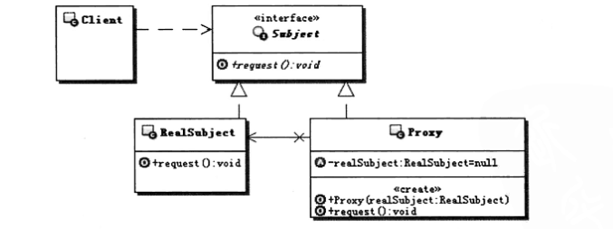
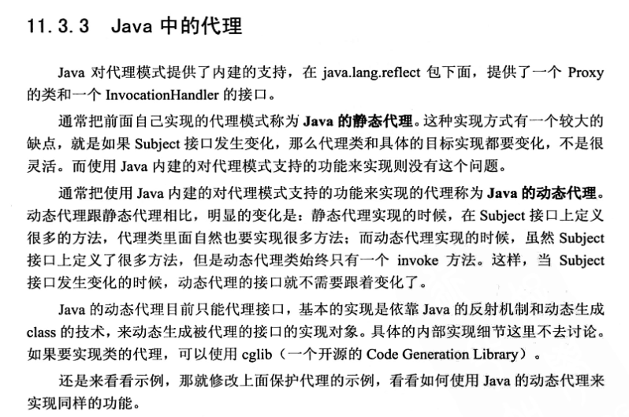

[TOC]

## Proxy—结构模式

#### 代理模式的结构



在需要用比较通用和复杂的对象指针代替简单的指针的时候，使用P r o x y 模式。下面是一 些可以使用P r o x y 模式常见情况：

1. 远程代理（Remote Proxy ）为一个对象在不同的地址空间提供局部代表。 NEXTSTEP[Add94] 使用N X P r o x y  类实现了这一目的。Coplien[Cop92] 称这种代理为“大使” （A m b a s s a d o r ）。

2. 虚代理（Virtual  Proxy ）根据需要创建开销很大的对象。在动机一节描述的I m a g e P r o x y 就是这样一种代理的例子。 

3. 保护代理（Protection Proxy ）控制对原始对象的访问。保护代理用于对象应该有不同 的访问权限的时候。例如，在C h o i c e s 操作系统[  C I R M 9 3 ]中K e m e l P r o x i e s 为操作系统对象提供 了访问保护。

4. 智能指引（Smart  Reference ）取代了简单的指针，它在访问对象时执行一些附加操作。 它的典型用途包括：  
   - 对指向实际对象的引用计数，这样当该对象没有引用时，可以自动释放它(也称为S m a r tP o i n t e r s[ E d e 9 2 ] )。  
   - 当第一次引用一个持久对象时，将它装入内存。  
   - 在访问一个实际对象前，检查是否已经锁定了它，以确保其他对象不能改变它。 


#### 	定义

为其他对象提供一种代理以控制对这个对象的访问。

#### 案例

委托类传入代理类中，代理类实现委托接口重写方法增强功能并调用委托类

```java
// 租房接口
public interface RentingHouse{
    void rentHouse();
}

// 委托类
public class IRentingHouseImpl implements RentingHouse{
    @Override
    public void rentHouse(){
        System.out.print("我要租一室一厅");
    }
}

// 代理类
public class IRentingHouseProxy implements RentingHouse{
    
    RentingHouse rentHouse;
    
    public IRentingHouseProxy(RentingHouse rentHouse){
        this.rentHouse = rentHouse;
    }
    
    @Override
    public void rentHouse(){
        System.out.print("中介（代理）收取3%服务费");
        rentHouse.rentHouse();
        System.out.print("客服信息买了3毛钱");
    }
}

public class Test {
    public static void main(String[] args){
        RentingHouse iRentingHouse = new IRentingHouseImpl();  // 委托对象
        RentingHouse iRentingHouseProxy = new IRentingHouseProxy(iRentingHouse); //代理类
        iRentingHouseProxy.rentHouse();
    }
}
```

#### 缺点

无法将代理类通用给其他委托类使用，在代理类中固定了传入的委托类类型。



#### 使用动态代理

[详情查看java动态代理](../体系化学习/java/基础/代理/jdk代理以及cglib代理)
