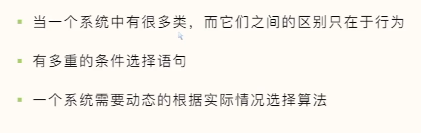
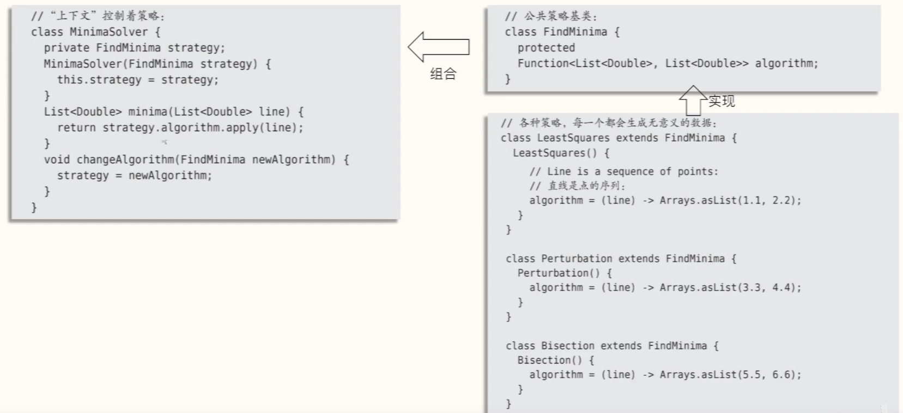
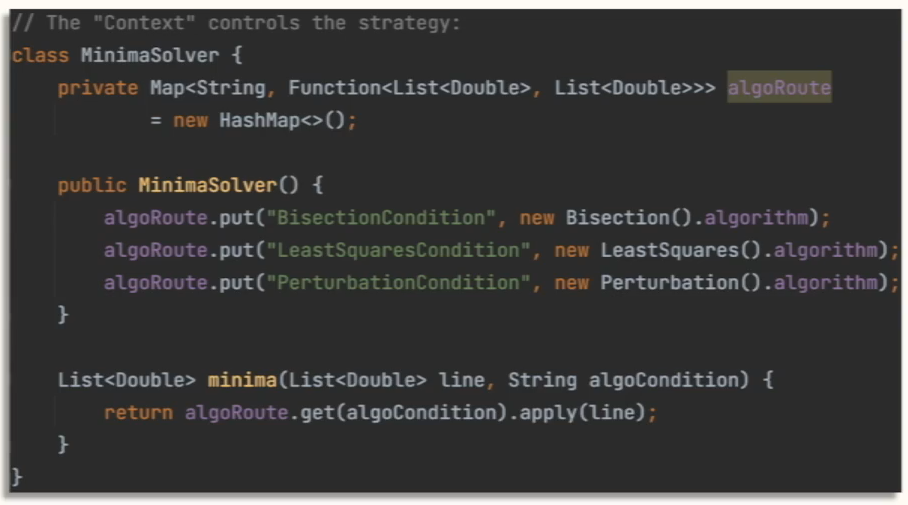
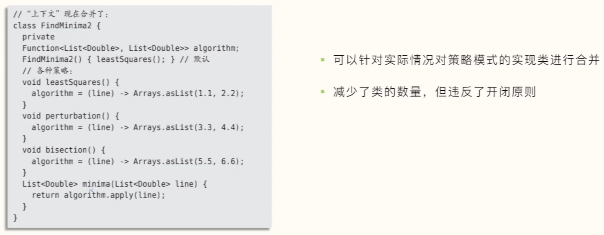
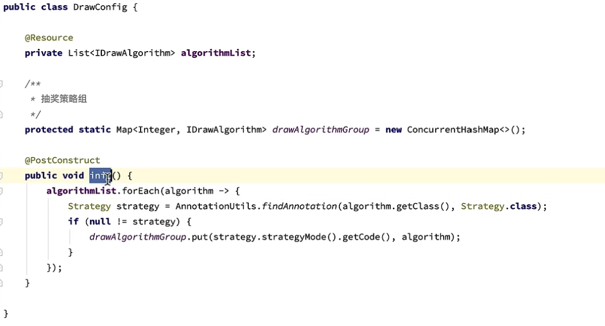

[toc]

## Strategy—行为模式

#### 1.结构类图


- Strategy：策略基类（也可以是接口），保证策略（算法）的一致性，Context通过这个接口来调用具体的策略实现类

- ConcreteStrategy：具体的策略实现（算法）
- Context：上下文，负责和具体的策略实现类交互。持有一个真正的策略实现。该类可以让具体的策略类来获取当前类的数据，甚至回调当前类的方法。


#### 2.定义
###### 定义一系列的算法,把它们一个个封装起来, 并且使它们可相互替换。本模式使得算法可独立于使用它的客户而变化。

#### 3. 适应场景




#### 4. 实用

##### 1. 传统策略使用



##### 2. 实际项目中使用

一般都是通过不同的条件来选择对应的策略实现类，可以用过Map映射对应的算法



##### 3. 项目中优化使用

将上下文、策略基类、策略实现类三合一，减少类的数量




#### 5.示例
##### 策略接口

```java
package com.example.demo5.design.strategy;

public interface QueryFlight {

    String getFlight(String param);
}

```

##### 策略实现A

```java
package com.example.demo5.design.strategy;

import org.springframework.stereotype.Service;

/**
 * @ClassName AqueryFlight
 * @Author Wangwentao
 * @Date 2020/9/25 15:33
 * @Description
 */
@Service
public class AqueryFlight implements QueryFlight{
    @Override
    public String getFlight(String param) {
        return "a";
    }
}

```

##### 策略实现B

```java
package com.example.demo5.design.strategy;

import org.springframework.stereotype.Service;

/**
 * @ClassName BqueryFlight
 * @Author Wangwentao
 * @Date 2020/9/25 15:33
 * @Description
 */
@Service
public class BqueryFlight implements QueryFlight{
    @Override
    public String getFlight(String param) {
        return "b";
    }
}

```

##### 上下文

- 结合Spring-1

```java
package com.example.demo5.design.strategy;

import org.springframework.beans.factory.annotation.Autowired;
import org.springframework.stereotype.Service;

import java.util.HashMap;
import java.util.Map;

/**
 * @ClassName QuerFlightServiceImpl
 * @Author Wangwentao
 * @Date 2020/9/25 15:34
 * @Description
 */
@Service
public class QuerFlightServiceImpl implements QueryFlight{

    /**
     * 自动装载各个策略实现类至map，key为实现类bean Name，省去工厂模式动态或者相应的实现类
     */
    @Autowired
    private Map<String,QueryFlight> map = new HashMap<String,QueryFlight>();

    @Override
    public String getFlight(String param) {
        String flight = map.get(param).getFlight("1");
        return flight;
    }
}

```

- 结合Spring-2

  策略接口中除了定义策略行为，还定义一个getType策略类型。

  策略上下文/控制类，获取所有策略实现类，并根据实现类getType作为key，组装进Map

```java
@Component
public class GroupLabelStrategyContext implements ApplicationContextAware{

    //存放对应的类型和实现类
    private Map<String, IGroupLabelStrategyService> map = new ConcurrentHashMap<>();

    //策略实现类注入到map
    @Override
    public void setApplicationContext(ApplicationContext applicationContext) throws BeansException {
        Map<String, IGroupLabelStrategyService> tempMap = applicationContext.getBeansOfType(IGroupLabelStrategyService.class);

        tmepMap.values().forEach(strategyService -> map.put(strategyService.getType(), strategyService));
    }

    //工厂方法
    public boolean processBiz(ParamDTO dto){

        //根据不同类型，获取不同的实现类
        IGroupLabelStrategyService groupLabelStrategyService= map.get(dto.getType());

        if (batchGroupLabelJudgeService != null) {
            return groupLabelStrategyService.processBiz(dto);
        }
        return false;     
    } 
}
```

- 结合Spring-3

  通过在具体的策略实现类中添加自定义注解，做一个业务标识，最终通过业务标识即可获取对应策略类。

  策略上下文/控制类 通过注入策略List集合，根据业务标识作为Key，将实现类组装进Map


