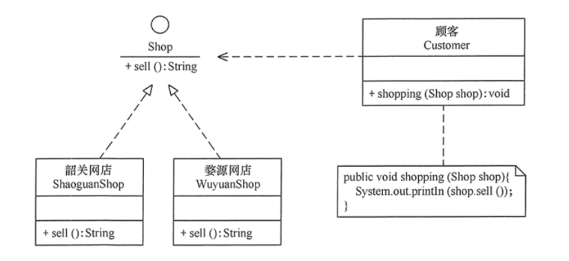

[toc]

## 单一职责原则(Single Responsibility Principle)

#### 1. 单一职责原则的定义

单一职责原则又称单一功能原则

该原则提出对象不应该承担太多职责，如果一个对象承担了太多的职责，至少存在以下两个缺点：

1. 添加多个职责将可能会互相造成影响
2. 当客户端需要某个功能而请求该类时，不得不将其不需要的功能全都响应给客户端，从而造成冗余代码或代码的浪费。

#### 2. 单一职责原则的优点

核心就是**控制类的粒度大小**、**对象解耦**、**提高其内聚**。如果遵循单一职责原则将有以下优点。

1. 降低类的复杂度
2. 提高类的可读性
3. 提高系统的可维护性
4. 变更引起的风险降低

#### 3. 单一职责原则的实现方法

单一职责原则是**最简单但又最难运用**的原则，需要设计人员**发现类的不同职责并将其分离，再封装到不同的类或模块中**。而发现类的多重职责需要设计人员**具有较强的分析设计能力**和相关**重构经验**。


## 开闭原则(Open-closed Principle)

#### 1. 开闭原则的定义

开闭原则：软件实体应当对扩展开放，对修改关闭

当应用的需求改变时，在不修改软件实体的源代码或者二进制代码的前提下，可以扩展模块的功能，使其满足新的需求。

软件实体包括以下几个部分：

- 项目中划分出的模块
- 类与接口
- 方法

#### 2. 开闭原则的作用

开闭原则是面向对象程序设计的终极目标，它使软件实体拥有一定的**适应性**和**灵活性**的同时具备**稳定性**和**延续性**。具体来说，其作用如下。

1. 对软件测试的影响
2. 可以提高代码的可复用性
3. 可以提高软件的可维护性

#### 3. 开闭原则的实现方法

通过“**抽象约束、封装变化**”来实现开闭原则，即通过**接口或者抽象类**定义一个抽象层，将相同的可变因素封装在具体实现类中或者抽象类中。

通过继承实现对目标类的的扩展，而不是直接在目标类上修改


## 里氏替换原则 (The Liskov Substitution Principle)

#### 7.4.1 里氏替换原则的定义

里氏替换原则是继承复用的基础，它反映了基类与子类之间的关系，是**对开闭原则的补充**。**总结：子类可以扩展父类的功能，但不能改变父类原有的功能**

#### 7.4.2 里氏替换原则的作用

1. 里氏替换原则是实现开闭原则的重要方式之一。
2. 它克服了继承中重写父类造成的可复用性变差的缺点。
3. 它是动作正确性的保证。即类的扩展不会给已有的系统引入新的错误，降低了代码出错的可能性。
4. 加强程序的健壮性，同时变更时可以做到非常好的兼容性，提高程序的维护性、可扩展性，降低需求变更时引入的风险。

#### 7.4.3 里氏替换原则的实现方法

1. 子类可以实现父类的抽象方法，但不能覆盖父类的非抽象方法
2. 子类中可以增加自己特有的方法


## 接口隔离原则 (Interface Segregation Principle)

#### 7.3.1 接口隔离原则的定义

接口隔离原则要求程序员尽量将臃肿庞大的接口拆分成更小的和更具体的接口，让接口中只包含客户感兴趣的方法。

接口隔离原则和单一职责原则的共同点与不同点

共同点：

- 都是为了提高类的内聚性、降低它们之间的耦合性，体现了封装的思想，

不同点：

- 单一职责原则注重的是职责，而接口隔离原则注重的是对接口依赖的隔离。
- 单一职责原则主要是约束类，针对的是实现细节，而接口隔离原则主要约束接口，针对抽象和程序整体框架的构建。

#### 7.3.2 接口隔离原则的优点

接口隔离原则是为了约束接口、降低类对接口的依赖性，遵循接口隔离原则有以下 5 个优点。

1. 提高系统的灵活性和可维护性
2. 降低系统的耦合性。
3. 保证系统的稳定性
4. 使用多个专门的接口还能够体现对象的层次，因为可以通过接口的继承，实现对总接口的定义。
5. 能减少项目工程中的代码冗余

#### 7.3.3 接口隔离原则的实现方法

在具体应用接口隔离原则时，应该根据以下几个规则来衡量。

- 接口尽量小，但是要有限度。一个接口只服务于一个子模块或业务逻辑。
- 为依赖接口的类定制服务。只提供调用者需要的方法，屏蔽不需要的方法。
- 了解环境，拒绝盲从。每个项目或产品都有选定的环境因素，环境不同，接口拆分的标准就不同深入了解业务逻辑。
- 提高内聚，减少对外交互。使接口用最少的方法去完成最多的事情。

**举例**:

学生成绩管理程序包含插入成绩、删除成绩、修改成绩、计算总分、计算均分、打印成绩信息、査询成绩信息等功能

1. 如果将这些功能全部放到一个接口中显然不太合理
2. 正确的做法是将它们分别放在输入模块、统计模块和打印模块等 3 个接口中


## 依赖倒置原则 (Dependence Inversion Principle)

#### 7.5.1 依赖倒置原则定义

高层模块不应该依赖低层模块，两者都应该依赖其抽象；**抽象不应该依赖细节，细节应该依赖抽象**。

**其核心思想是：要面向接口编程，不要面向实现编程。**

#### 7.5.2 依赖倒置原则的作用

依赖倒置原则的主要作用如下。

1. 可以降低类间的耦合性。
2. 可以提高系统的稳定性。
3. 可以减少并行开发引起的风险。
4. 可以提高代码的可读性和可维护性。

#### 7.5.3 依赖倒置原则的实现方法

**依赖倒置原则在“顾客购物程序”中的应用**

商店类Shop中有 sell() 方法，顾客类中又shopping()方法，现在去A商店购物

```java
class Customer { 
    public void shopping(AShop shop) { 
        //购物 
        System.out.println(shop.sell()); 
    } 
}
```

但是，顾客想从B商店购物，就要将该顾客的代码修改如下

```java
class Customer { 
    public void shopping(BShop shop) { 
        //购物 
        System.out.println(shop.sell()); 
    } 
}
```

顾客每更换一家商店，都要修改一次代码，这明显违背了开闭原则。存在以上缺点的原因是：顾客类设计时同具体的商店类绑定了，这违背了依赖倒置原则。

做法是，将所有的商店实现同一个商店接口


