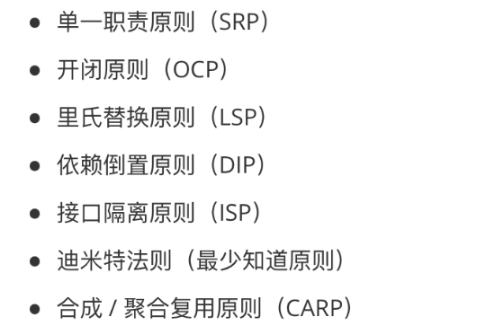
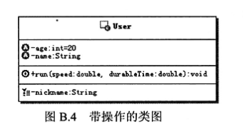
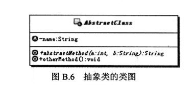
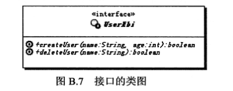
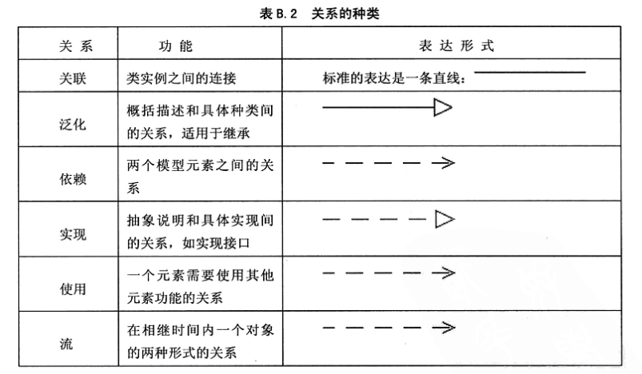
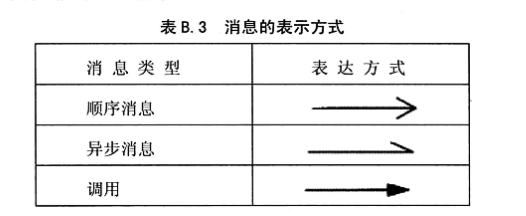
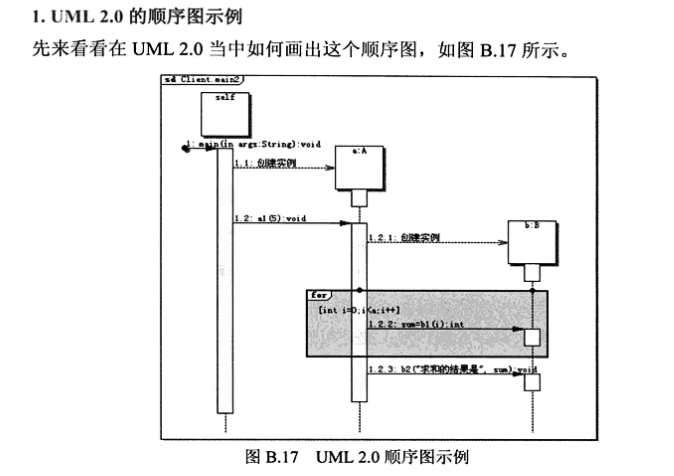

[toc]

### 什么是设计模式？

设计模式是我们开发软件时针对常见问题的 **通用** 解决方案，也是前辈们在写代码时不断摸索总结出来的好方法。

可以理解为打游戏的攻略，就是我们遇到同一类的对手时，怎么走位、怎么放技能之类的。

### 设计模式有什么用？

设计模式最直接的作用就是 **减少烂代码、让项目代码更好维护、扩展性更高** 。

举个栗子，如果没学过设计模式，可能随着产品不断加需求、改需求，你的代码会充满大量的 if else，新同事来了呢，也不敢动前人代码，只能再去补充 if else，于是屎山越堆越高。

而使用设计模式后，你可以把每段逻辑单独封装和维护，大家协作开发也会更高效。

### 为什么要学设计模式？

学好设计模式，不仅能让我们写出更好维护、性能更高的代码，还能开拓我们的思维，在遇到问题时能想到更多的解决方案。

因此设计模式也是软件开发岗面试的重点，想进大厂的同学一定要学习它。

此外，很多知名项目都用到了大量的设计模式，比如 Spring、MyBatis 等。如果不学习它，可能你天天写代码都是 CRUD、读别人的源码会非常吃力。

### 设计模式的知道思想

软件开发原则，所有的设计模式基本都是建立以下几个设计原则的基础上。

### 分类

1. 创建型模式：抽象了对象实例化过程，用来帮助创建对象的实例

2. 结构型模式：描述如何组合类和对象以获得更大的结构

3. 行为型模式：描述算法和对象间职责的分配

### UML基础

- 类图

- 抽象类图

- 接口图

- 类图关系连线

- 时序图连线

- 时序图

