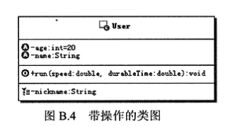

[toc]

### 简介

##### 1.设计模式：软件开发中，经过验证的，用于解决特定场景下，重复出现的，特定问题的，解决方案

##### 2.设计模式是前人经验的积累和总结，理论上来说设计模式只是相对优秀的解决方案，有可能存在比设计模式更优秀的解决方案。

##### 3.设计模式也不断地在发展，任何人只要能总结一些解决方案并且得到公众认可和验证，也能成为解决方案

### 分类

##### 1.创建型模式：抽象了对象实例化过程，用来帮助创建对象的实例

##### 2.结构型模式：描述如何组合类和对象以获得更大的结构

##### 3.行为型模式：描述算法和对象间职责的分配

### UML基础

##### 类图

##### 抽象类图

##### 接口图

##### 类图关系连线

##### 时序图连线

##### 时序图

