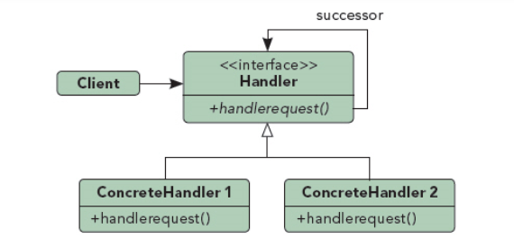
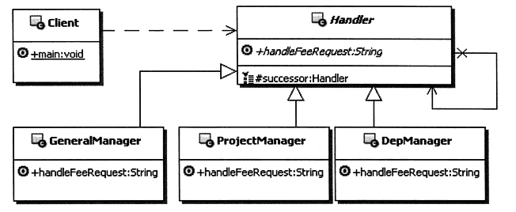

## Chain of Responsibility——行为模式

##### 结构

- Handler：定义职责的接口，定义处理请求的方法，并可以实现后继链。
- ConcreteHandler：实现职责的类，实现对它职责范围内请求的处理。

##### 定义

使多个对象都有机会处理请求，将这些对象连成一条链，并沿着这条链传递请求，直到有一个对象处理它为止。

##### 优势

可以在Handler中**灵活构建业务流程步骤，将处理对象灵活组合**，而每个处理请求的对象只实现业务流程中的一步业务处理。最后责任链模式就能动态组合这些处理请求的对象，把它们按流程动态组合，并依次调用，**动态地实现了流程**。

##### 案例

### 功能链模式

如上所述，单纯的责任链模式是一个handler处理了请求，则后续handler不在执行。

在实际应用中，通常会对责任链进行改进，一个请求通过一系列handler来完成复杂的业务处理，改进模式被称为功能链模式

如：Servlet中的过滤器的链式处理、zookeeper服务器对请求的链式处理、spring aop对所有通知的链式处理，都利用了功能链模式

