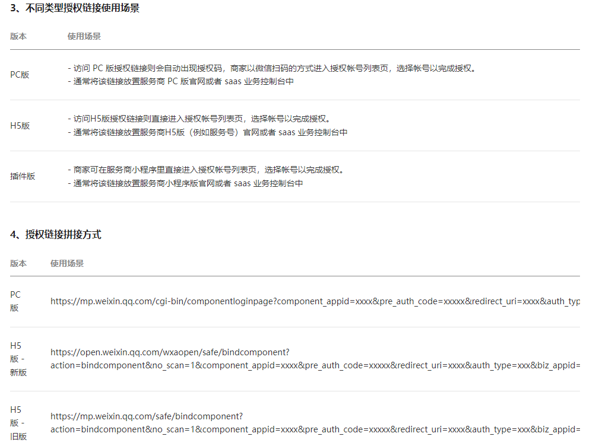

[开源的第三方微信开放平台API](https://github.com/Wechat-Group/WxJava/wiki/MP_%E7%BE%A4%E5%8F%91%E6%B6%88%E6%81%AF)

```xml
<dependency>
    <groupId>com.github.binarywang</groupId>
    <artifactId>weixin-java-open</artifactId>
</dependency>
```

[开放平台api文档](https://developers.weixin.qq.com/doc/oplatform/openApi/OpenApiDoc/)

[开放平台文档](https://developers.weixin.qq.com/doc/oplatform/Third-party_Platforms/2.0/getting_started/terminology_introduce.html)


1. 获取第三方平台token: POST https://api.weixin.qq.com/cgi-bin/component/api_component_token

   

2. 获取 预授权码: POST https://api.weixin.qq.com/cgi-bin/component/api_create_preauthcode?access_token=ACCESS_TOKEN

   

3. 获取跳转微信授权页链接，并重定向给前端:

   拼接第三方appid、授权码、授权后回调URL（返回授权码）

   

   ```java
   String preAuthUrlStr = String.format(isMobile ? "https://mp.weixin.qq.com/safe/bindcomponent?action=bindcomponent&no_scan=1&auth_type=3&component_appid=%s&pre_auth_code=%s&redirect_uri=%s&auth_type=xxx&biz_appid=xxx#wechat_redirect" : "https://mp.weixin.qq.com/cgi-bin/componentloginpage?component_appid=%s&pre_auth_code=%s&redirect_uri=%s&auth_type=xxx&biz_appid=xxx", this.getWxOpenConfigStorage().getComponentAppId(), jsonObject.get("pre_auth_code").getAsString(), URIUtil.encodeURIComponent(redirectUri));
   ```

4. 用户授权成功后，根据微信回调的授权码获取授权方appid: POST https://api.weixin.qq.com/cgi-bin/component/api_query_auth?access_token=ACCESS_TOKEN

   


[微信公众号文档](https://developers.weixin.qq.com/doc/offiaccount/Message_Management/Batch_Sends_and_Originality_Checks.html#0)

1. 上传消息内的图片并获取URL: https://api.weixin.qq.com/cgi-bin/media/uploadimg?access_token=ACCESS_TOKEN

2. 上传临时素材并获取mediaId: https://api.weixin.qq.com/cgi-bin/media/upload?type=%s

3. 上传消息素材: https://api.weixin.qq.com/cgi-bin/media/uploadnews?access_token=ACCESS_TOKEN

4. 群发消息: https://api.weixin.qq.com/cgi-bin/message/mass/sendall?access_token=ACCESS_TOKEN

   

   

   5. 查询群发消息发送状态: POST https://api.weixin.qq.com/cgi-bin/message/mass/get?access_token=ACCESS_TOKEN

      

6. 群发事件回调结果:

   [微信公众号官方文档](https://developers.weixin.qq.com/doc/offiaccount/Message_Management/Batch_Sends_and_Originality_Checks.html#7)

   由于群发任务提交后，群发任务可能在一定时间后才完成，因此，群发接口调用时，仅会给出群发任务是否提交成功的提示，若群发任务提交成功，则在群发任务结束时，会向开发者在公众平台填写的开发者URL（callback URL）推送事件。

   

   