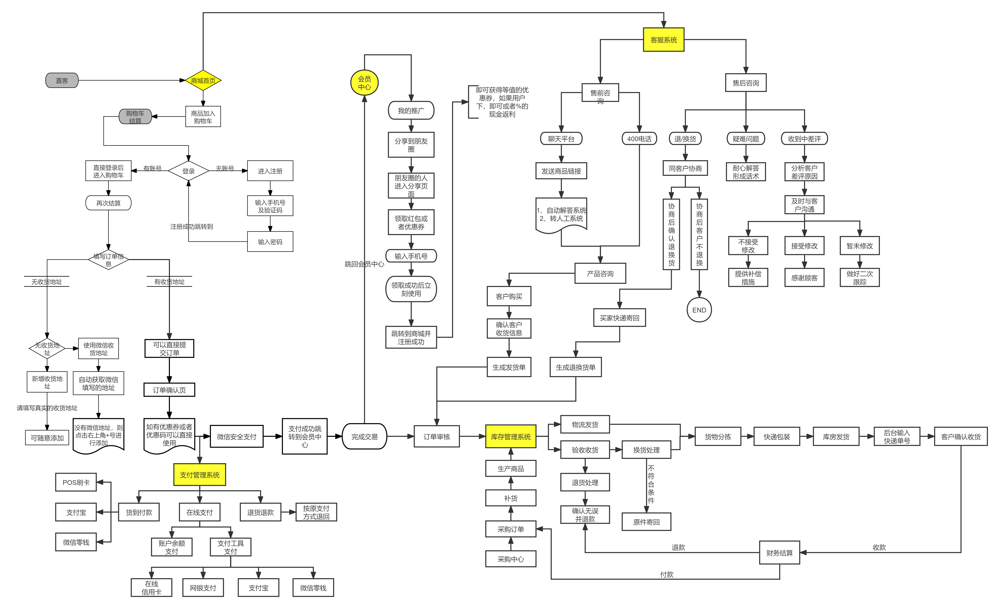
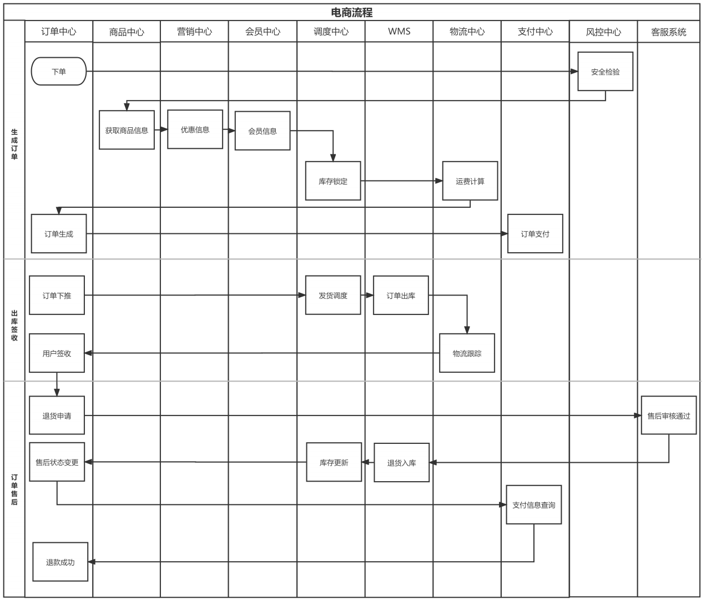
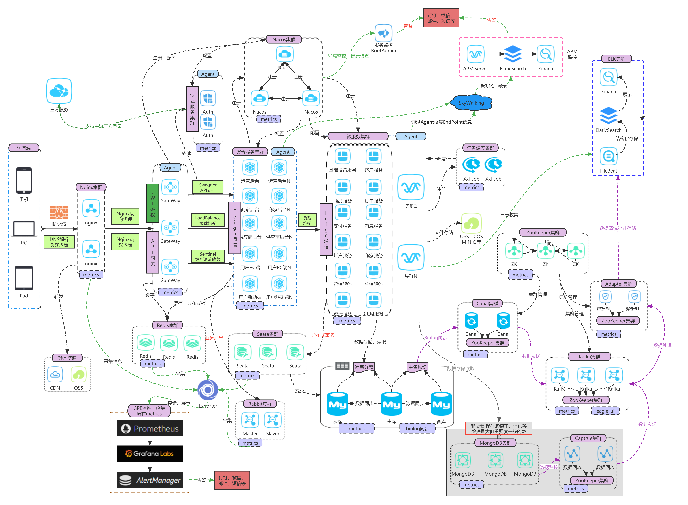

### 1. 电商项目介绍

##### 1.1 业务流程图

电商系统核心链路为：浏览商品、加入购物车、交易下单、支付提交、商品退货，每一个流程都牵涉了大量的分布式服务之间调用

##### 1.2 性能指标

业务峰值 DAU (Daily Active User，日活跃用户) 5000万左右，常规1000万左右，月销售额750亿元，订单处理能力每秒钟20000单（TPS2w），技术团队 2000 人。

阿里天猫的峰值DAU 2亿，交易订单TPS峰值超50w。

- TPS：Transactions Per Second，每秒事务数。
- QPS：Queries Per Second，每秒查询率。
- UV：Unique Visitor，自然访客
- PV：Page View，页面访问次数

QPS、机器数参考公式：

- （总PV数 * 80%） / （每天描述 * 20%） = 峰值时间每秒请求数（QPS）

- 机器数 = 峰值时间QPS / 单台机器的QPS

##### 1.3 项目架构图

监控埋点，这种埋点不是给产品和运营分析用户的，是让开发/运维对自己的程序有个更精准的认识

比如：

1. 定时采集服务器的cpu负载，内存占用情况，io负载，java的gc信息

2. 程序执行某个功能的耗时，进行远程调用时的耗时

3. 程序在一段时间内捕捉到了哪些异常

4. 在一段时间内，远程接口的平均响应时间，请求次数，成功返回次数，失败次数，超时次数

这种埋点有助于开发、运维分析程序的性能问题，监控程序的健康程度，提早进行异常的告警

这样的埋点称为metric，Prometheus、Grafana Labs就是一款很优秀的开源的metric监控，你只需要定时把埋点数据提交给它，可以查看各项metric的统计曲线，并设定告警规则，当某个metric达到告警阈值，可以通过邮件、短信、即时通信程序（IM）向你推送告警信息

由于这样的埋点对业务代码有很严重的侵入，所以很多公司会开发通用的埋点框架，采用反射等方式进行运行监控

