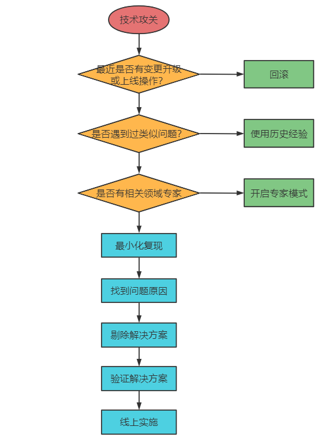

[toc]

## 一、当前项目

### 1. 项目名称

某航空公司商务移动应用平台

### 2. 项目的业务背景

南航商务移动应用平台为中国南方航空开发的航旅平台，平台提供机票预订、行程管理、航班动态、权益中心、旅游度假等服务。目前拥有超过7000万的注册的会员，每天超过1000万的PV。基础服务包括国际票价、国内票价、订单中心、支付中心、营销中心、风控中心、常客中心、通知中心等。

### 3. 项目的核心架构图

**整体架构**

**权益中心服务**

1. 接入层
   1. Openrestry + keepalived 高可用负载均衡集群（lua预热脚本、静态资源存储CDN或者OSS）
   2. API 网关（统一JWT认证、流量拦截、负载均衡）
2. 服务层
   1. 采用分层架构，微服务治理采用SC的一些组件（Nacos服务发现和配置中心、Feign远程调用、Histrix熔断降级、Sleuth聚合链路追踪+Zipkin、）以及RPC通信框架
   2. 业务服务层（内部使用RPC通信，调用基础服务使用Feign通信）
   3. 基础服务层（基础服务只提供上游业务系统使用）
3. 缓存层
   1. Redis（Cluster + 主从哨兵）
   2. GuavaCache（本地缓存）
4. 存储层
   1. Mysql（主从 + 热备 + 分库分表）
   2. （ES）（复杂查询）
   3. 阿里OSS服务
5. 各个中间件
   2. ZK（如ES、Canal、RPC的服务注册与发现）
   3. MQ（消息分发、异步解耦削峰）
   4. Canal（数据同步）
   5. ELK（分布式日志）
   5. 普罗米修斯监控埋点（服务埋点）

### 4. 你在该项目中的职责、任务？你所负责的部分用到了哪些技术？以及有哪些亮点？

我负责聚合业务服务中的，机票预订产品的开发。该产品下又细分机票查询、订单、支付等模块，技术选型为SpringBoot、SpringMVC、SpringCloud（Nacos、Feign、Hystrix、GateWay、Sleuth、Zipkin）、Redis、MySQL、RocketMQ、Motan

##### 亮点1：修改支付回调方案，解决了促销日有用户订单状态长时间未同步问题，回调接口TPS 由110提升到400+ 

- 描述

  用户支付成功后，**支付服务通过异步回调我们的接口**，通知我们支付结果。我们对回调参数进行解密验签和解析，校验支付结果和当前订单状态，然后**调用订单服务修改状态**、**通知服务发送短信**、**历程积分服务增加积分**。异步回调接口中有**大量同步业务的处理**以及**多次远程调用**，**回调失败的不断重试**。本来回调接口的TPS峰值为110多，在流量高峰QPS达到TPS两三倍时，大量请求堆积并且不断重试，导致部分用户支付状态可能长时间未同步。

- 解决方案

  将同步调用订单服务、短信服务、历程积分服务的流程，改为MQ异步分发消息的技术方案。支付回调接口的本地事务只做支付信息的记录，接口TPS提升两倍（只提升四倍是因为单库写的瓶颈，只能维持500~600的TPS）

##### 亮点2：采用缓存以及API网关层限流措施，解决了疫情期间大批量异常流量的攻击

- 描述

  系统监控日志发现流量异常（查票接口有规律的5-6W的QPS），定位到应该是有黄牛使用爬虫程序恶意扣票。就是订票不支付，然后在订单超时之前自动取消订单同时又将这张票订下。他们有很多个账号，之前好像检测中的有几百个了，交替反复的进行上述操作，大概5到6账号维护一张票，规避了系统针对单个账号频繁订票的防占座机制。同时发现还有大批量异常活动的IP，即使经过nginx限流依然还能保持2k+的额外qps，并且经常变更请求的频率。

- 提升接口QPS

  - **使用多级缓存优化查票接口**

- **限流策略**

  - 针对读服务，**IP和账号**请求频率可疑的，一小时内超过100次的，提高限流阈值为10分钟一次。（由于nginx限流后单个ip不超过2~3个每秒，所以没必要使用setnxex锁。直接exist然后setex或incr即可）

    这次操作直接降低大部分读服务的异常流量，一天的PV直接降低5000W~6000W

  - 分析账号行为，针对订票和退票的请求频率超过6次每3小时的，弹出验证码进行人机识别。

  - 针对订票的接口，IP请求频率可疑的，无法发现。因为谁也不知道什么时候有票，对方也只有读到有票时才并发去抢票。并且扣票的话完全可以10分钟一次

##### 亮点3：权益中心权益包下单请求大量超时异常，使用Redis库存扣减解决数据库扣减的瓶颈

- 描述

  上线开放PLUS窗口发售权益包（PLUS会员年卡包、机票权益包、套餐权益包等），其中包含很多权益项（如机票券、行李券、休息室、酒店优惠）。发现后台有一些热门的权益包出现了超卖现象。

- 分析

  日志排查发现权益下单接口QPS峰值达到2000+，查看接口逻辑，是否允许重复购买判断、是否超出可购买数量、是否有未支付订单等校验后，直接使用Mysql的非负约束的整数进行扣减，库存扣减的并发控制给到数据库，单库写请求过大耗尽数据库连接资源，出现大量下单请求超时失败。
  
- 解决方案

  方案有1.使用分布式锁+自旋等待、2.购买记录和库存扣减走Redis、3.分库分表分散单库写压力。最终选择了使用Redis库存扣减解决数据库扣减的瓶颈

##### 亮点4：使用分布式锁对优惠券的领取做并发控制

> ##### 暂不考虑
>
> ##### 亮点5：线上某业务预测后续将面临十倍的流量 ，由原来的1300QPS提升到15000QPS。服务实例12台，接口：RPC调用下游 3个接口并处理业务，然后写数据库。
>
> - 压测观察硬件指标       
>   - **发现WEB容器内存CPU指标都没达到瓶颈，往上调整了线程池、连接池，充分利用了硬件资源。   400+ --->  700+**
>   - 若硬件指标达到瓶颈，则在线上进行水平扩容。
>
> - 读业务的提升
>   - 多级缓存
>
>     **对其中两个时效性不高的接口数据做缓存，并设置一个合理的TTL值。另一个接口设置较短的TTL 1秒。单机QPS 由100+ ---> 400+**
>   
> - 写业务的提升
>   - 使用FIFO先进先出队列，如MQ来异步、削峰，到达高吞吐量。缺点是业务需要接受异步场景
>   - 记录写Redis，然后通过MQ异步消费，Redis就天然满足高并发。缺点是需要保证Redis的高可用
>   - **发现数据库已经达到瓶颈，简单SQL优化空间很小，考虑对表进行分库分表。   700+ ---> 1500+**
>   - 若后续还要达到几十万的写TPS，除了分库分表，还可以弹性伸缩、扩机房、不同城市异地多活。
>

### 5. 相关数据指标、性能指标要求？具体是什么？

会员人数达到 6000W+

PV峰值 2000W+

查票峰值QPS 700

查询服务机器数：60台

下单TPS 几十

下单服务机器数：10台

高性能：

- 查票业务，TP90指标 要求为 < 100ms
- 下单业务，TP90指标 要求为 < 800ms

高可用：>99.9%

高并发：查票QPS > 50W，订单业务的TPS >2000

## 二、实现高并发功能-秒杀

### 1. 秒杀系统功能需求

#### 特性

- 时间短
- 库存少
- 并发高

#### 业务流程图

#### 前端交互逻辑

#### 后端需求分析

- 秒杀活动页需求的秒杀活动信息列表的接口，活动开始时间、结束
- 时间、商品列表。对应提醒按钮需求的Push订阅接口
- 对应商品详情页需求的商品活动接口信息
- 对应秒杀按钮需求的秒杀抢购接口
- 获得商品信息，对接商品中心
- 商品库存信息，对接库存中心
- 抢购生成订单，对接交易中心

#### 管理后台需求

- 活动场次信息管理：场次时间、商品种类
- 活动商品信息管理：商品数量、种类、型号、折扣等
- 缓存管理

#### 非功能需求

非功能需求是**系统在特定条件下正常运行的最低要求**。在系统的设计之初，我们就应当给这些最低要求赋予明确的定义，**给出明确的指标**，为了分析，可将影响要素分为与系统运行环境有关的**内部因素与系统运行环境无关的外部因素**

- 高可用指标，如，可用性方面要高于 99.99%
- 高性能指标，如，高性能方面要求请求延迟小于 200ms（TP90 200ms）
- 高并发指标，如，高并发方面要求QPS 大于 10万，订单TPS达到20000
- 安全防护能力
- 运营/运维成本

#### E-R图

### 2. 秒杀系统架构设计

#### 2.1 面对的挑战

##### 2.1.1 对现有的业务冲击

秒杀**拆分为独立服务**（也包括页面）

##### 2.1.2 高并发下的服务和数据库的压力

- **多级缓存**，CDN存储大量静态资源，本地缓存热卖商品详情，Redis分布式缓存非热卖商品详情。缓存一致性可采用主动更新策略：数据库更新，canal发送增量日志到MQ，消费者更新缓存数据

- **限流**，将**写请求拦截在系统上游**（有效请求非常低的情况）

- 数据库**使用分库分表和读写分离**

##### 2.1.3 怎么防止库存超卖

- 库存少，有效请求少

  - 通过**分布式锁控制库存扣减**，**降低**数据库**行锁竞争压力**并且**防止超卖**；

- 库存多，需要吃下大部分请求

  - **库存扣减、秒杀记录走缓存**（库存判断及扣减等操作需要使用Lua脚本完成，保证操作的原子性隔离性），然后发布消息到MQ**异步更新到数据库**，订单生成调用订单服务、营销服务扣减优惠券、短信服务发送短信。

    **缺点：**若**Redis挂了重启，则可能会造成部分数据的丢失**。此时必然需要将库存从数据库中**重新加载到Redis中**，而此时数据库**消费了MQ中的扣减记录，造成Redis中的库存大于数据库**，可能导致超卖。

  - 请求走MQ，异步、削峰处理写请求，前提是业务需要接受这种异步的处理

  - 将库存进行分片到多个库中。然后通过uid进行路由到对应库存库，监控库存剩余5%时，将分片回收到主片中。并且由分布式事务来控制主片和分片的库存回收。

##### 2.1.4 如果使用了缓存，还需要注意：

- **缓存与数据库的一致性**

  - 主动更新

    更新数据库后，通过Canal中间件将binlog日志采集发送到MQ中，然后更新缓存

  - 被动更新

    被动或主动删除缓存（设置缓存key的ttl 或者 写数据库时删除缓存），然后在**读时，查数据库回填数据到缓存**，这属于被动更新

    **注意：**针对热点Key的高并发场景，采取**延时双删策略**。读时可能造成**缓存击穿**，可以采用**分布式锁控制一个请求去查库**，剩余请求**阻塞等待缓存更新，可设置等待超时时间**

- **怎么防止缓存雪崩、缓存击穿、缓存穿透的**

- 如果有**事先未预料到的商品突然成为热点，流量突然激增**，有什么应急措施。

  应急措施：对该商品的**限流阈值往下调（高并发系统必然有多种限流机制）**。

  正确做法：通过大数据的流式计算平台，如Flink对商品访问次数进行实时统计。当达到某个阈值时，进行**自动限流**，并将该商品**加载到本地缓存**，并开启主动更新策略或被动更新策略，**然后解除限流**

##### 2.1.5 订单未支付怎么及时取消

若业务要求超时订单**尽量准时自动取消**，则可利用MQ的**延时队列和死信队列**。将订单放入延时队列，设置延时时间，时间一到调用死信交换器将消息放入死信队列，然后将死信队列的订单进行回滚操作

##### 2.1.6 如果使用MQ，还需要注意：

- 消息丢失，消息重复消费（幂等性）

  虽然MQ自身有机制来保证各环节的消息一致性，防止消息丢失和消息重复。但网络传输总会有问题，生产方无法确保消息是否被消费方消费。

  解决方案：创建一个消息表，使用递增的全局唯一分布式ID对消息编号并标识状态。可以防止消息丢失和重复

  

- 消息积压

  中间件如Kafka和rocket单机TPS可达几十万每秒，所以瓶颈在于消费端。若突发积压，可扩容消费者实例数量。后续再排查原因，是否有硬件问题、网络问题、代码逻辑问题

##### 2.1.7 下游接口性能问题，如何降级处理

下游接口出现异常，可采用**有损、异步的降级处理方案**

- 比如库存扣减接口异常，可先生成订单，但是提醒用户正在出库，但是有可能无库存需要排队
- 比如视频/文章风控校验接口异常，可先发布但只能自己看，通过异步方式进行校验（如MQ分发、人工等）

##### 2.1.8 进攻与防守

- **一个账号**发起**大量并发请求**

  如领取奖励的逻辑，高并发的场景下，一个请求领取积分成功然后修改数据库记录，此时在这之间该用户还有上百个该请求，绕过了判断逻辑，重复领取积分

  使用Redis分布式锁，或者使用Redis事务watch的乐观锁特性

- **大量“僵尸账号”**发起**大量并发请求**

  检测IP请求频率，对其进行限流或者使用验证码防爬

- **大量“僵尸账号”**发起**不同IP**的**大量并发请求**

  这些人通过随机IP代理服务，发起大量不同ip的请求。只能通过设置业务门槛（如限制用户等级、活跃度、资料完善度等），来解决掉这部分的流量攻击

#### 2.2 架构设计的实现

结合上述的面对挑战，现在将整个链路从前端后数据库做出总结

##### 2.2.1 前端层

- 秒杀页面展示。
- 倒计时，与时间服务器同步时间，未到点不可点击。
- **请求拦截，防止重复大量的写请求。**

##### 2.2.2 站点层

- **页面的静态资源走CDN**
- **首页的数据**（广告、热销、推荐）通过OpenRestry的**Lua脚本加载预热缓存**，由数据库加载到分布式缓存和Nginx缓存中。数据一致性由主动更新策略来保持（改库 ---> Canal  --->  MQ --->  同步服务  --->  执行脚本冲洗加载数据）
- 根据ip频率和账号uid的请求次数进行**限流**，验证码来人机识别

##### 2.2.3 服务层

- 商品详情等信息**读缓存**，当数据库商品信息修改，则通过 canal->MQ 更新缓存数据。

- 库存扣减、生成订单（以下根据业务场景二选一）

  - 库存少，有效请求少

    - 通过**分布式锁控制库存扣减**，**降低**数据库**行锁竞争压力**并且**防止超卖**；

  - 库存多，需要吃下大部分请求

    - **库存扣减、秒杀记录走缓存**（库存判断及扣减等操作需要使用Lua脚本完成，保证操作的原子性隔离性），然后发布消息到MQ**异步更新到数据库**，订单生成调用订单服务、营销服务扣减优惠券、短信服务发送短信。

      **缺点：**若**Redis挂了重启，则可能会造成部分数据的丢失**。此时必然需要将库存从数据库中**重新加载到Redis中**，而此时数据库**消费了MQ中的扣减记录，造成Redis中的库存大于数据库**，可能导致超卖。

    - 请求走MQ，异步、削峰处理写请求，前提是业务需要接受这种异步的处理

    - 将库存进行分片到多个库中。然后通过uid进行路由到对应库存库，监控库存剩余5%时，将分片回收到主片中。并且由分布式事务来控制主片和分片的库存回收。

- RPC调用下游接口，需要做好降级处理。比如有损的降级处理，先降级响应，后处理

##### 2.2.4 数据库层

若库存够多，考虑数据库做分库分表 + 读写分离，若需要吃下百万的QPS，考虑多机房、异地多活

## 三、提升系统QPS（全链路的优化）

#### 寻找瓶颈

首先压测，寻找系统瓶颈，是硬件资源、还是应用服务、还是下游基础服务、还是缓存架构、还是数据库

#### 服务器瓶颈

- 若硬件资源被打满，如CPU、内存被打满，可考虑进行服务器扩容。但考虑到成本问题，可先放一放，往后看
- 若没有被打满，则可调整Web容器的线程池和连接池，往上调一调

#### 应用服务

首先要考虑是读业务还是写业务

- 前提是有监控到异常（如CPU利用率飙升或创建大量线程、线程死锁、频繁FullGC、内存告警等等），针对这些异常对应用服务代码进行优化。

  - CPU利用率飙升或创建大量线程：线程池使用了线程无限大的CacheThreadPool。。。
  - 频繁FullGC、内存告警：大量大对象、大量全局变量、方法中频繁创建同一对象。。。

- 其次再看，如果是**读业务**
  - 考虑使用多级缓存，并且确保本地缓存、分布式缓存、数据库数据一致性。如应用首页的数据，使用OpenRestry加载Lua脚本预热数据。
  
- 其次再看，如果是**写业务**
  - 使用**FIFO先进先出队列，如MQ**来异步、削峰，到达高吞吐量。缺点是业务需要接受异步场景
  
  - **记录写Redis，然后通过MQ异步写入数据库**，Redis就天然满足高并发。缺点是需要保证Redis的高可用
  
  - **发现数据库已经达到瓶颈，简单SQL优化空间很小，考虑对表进行分库分表。   700+ ---> 1500+**
  
    若后续还要达到几百万的写TPS，除了分库分表，还可以**弹性伸缩、扩机房、不同城市异地多活**。

#### 下游基础服务

下游基础服务的性能也将影响业务系统的QPS，所有当下游基础服务出现异常，可以做一些有损的降级处理

- 比如库存扣减接口异常，可先生成订单，但是提醒用户正在出库，但是有可能无库存需要排队
- 比如视频/文章风控校验接口异常，可先发布但只能自己看，通过异步方式进行校验（如MQ分发、人工等）

#### 缓存中间件

- 分布式缓存架构保证高可用高扩展。

- 本地缓存选好Guava Cache。

- 保证缓存与数据库数据的一致性

#### 数据库

- 优化SQL

- 若SQL不是瓶颈，则瓶颈在于数据库架构，升级为分库分表 + 读写分离
- 多维度的复杂查询，走ES。使用Canal同步Binlog实现数据一致性

## 四、线上问题应急措施、排查、解决

### 1、线上应急

对生产环境发生的任何怪异现象和问题都不要轻视，对其背后产生的原因一定要彻查。

生产环境发生故障，要快速优先想办法**恢复服务**，**避免或减少因故障造成的损失，降低对用户的影响**。

当线上出现问题时，**第一件事应该是启动应急措施**，**然后再慢慢排查问题并给出解决方案**

#### 1.1 应急原则

- **第一时间应该恢复系统**而不是彻底查找原因解决问题，**快速止损**。

- 有明显的**资金损失**时，要在**第一时间升级，快速止损**。该条用在金融领域尤为关键。

- 当前应急负责人若**短时间内无法解决问题**，**必须升级处理**。

- 应急过程中在不影响用户体验前提下，要保留部分现场和数据。便于恢复后定位分析问题原因。

#### 1.2 应急方法流程

应急要有总体目标：**尽快恢复问题，消除影响**。首要问题都是**优先恢复系统问题**，恢复问题**不要求立马定位问题**，也不一定有完美的解决方案。

一般通过经验判断，启动线上的问题预处理方案等，达到快读恢复问题的目标。同时，要注意保留部分现场，便于事后定位解决并复盘问题。

##### 1.2.1 发现问题

自动化监控的告警，分别有系统层面、应用层面、资源层面进行监控。

- 系统层面的监控：**CPU利用率**、**系统负载**、**内存使用情况**、**网络IO负载**、**磁盘负载**、**I/O等待**、**交换区的使用**、**线程数**及**打开的文件句柄数**等进行监控，一旦超出阈值，就及时告警。
- 应用层面的监控：对服务接口的**响应时间**、**吞吐量**、**调用频次**、**接口成功率**即接口的波动率进行监控。
- 资源层面的监控：数据库、缓存和消息队列的监控。我们通常会对数据库负载、慢SQL、连接数等进行监控；对缓存的连接数、占用内存、吞吐量、响应时间等进行监控；对消息队列的响应时间、吞吐量、负载、积压情况进行监控。

##### 1.2.2 定位问题

首先要根据经验来分析 ，应急团队中有人对相应问题有经验，并确定能够通过某种手段来进行恢复，则应第一时间快速恢复，同时保留现场，然后定位问题。

应急人员定位过程中可能需要与业务负责人、技术负责人、技术人员、运营和运维一起，对产生问题的原因进行快速分析。

需要考虑如下问题：

- 问题系统最近是否进行了上线操作？

- 依赖的基础平台和资源是否进行了上线或者升级？

- 依赖的系统最近是否进行了上线？

- 运营是否在系统里面做过运营变更？

- 网络是否有波动，联系运维人员协助排查？

- 最近的业务访问量是否正常，是否有异常流量？

- 服务的适用房是否有促销活动？

##### 1.2.3 应急预案、解决问题

解决问题的阶段有时在应急处理中，有时在应急处理后。理想情况下，**出现问题系统应该有应急预案**，每个系统会**对各种问题设计止损、兜底、降级开关等策略**。

因此，发生严重问题时可以**先启用这些预案来恢复问题**，事故之后**再详细定位和解决问题**。

##### 1.2.4 复盘问题

消除问题后，需要应急团队与相关方回顾事故产生的原因、应急过程的合理性，对树立处理啊的问题提出整改措施，主要聚焦一下几个问题：

- 类似的问题还有哪些没有想到？

- 做了哪些事情，这个事故就不会发生了？

- 做了哪些事情，这个事故即使发生了也不会产生损失？

- 做了哪些事情，这个事故即使发生过了，也不会产生这么大的损失？

当然，回顾事故目的不再犯类似的错误，而不是惩罚当事人。

##### 1.2.5 避免措施

根据回顾问题**提出改进方案和避免措施**，我们必须以正式的**项目管理方式进行统一管理**，如果有项目经理的角色，则**将避免措施和改进措施一并交给项目经理去跟进**；如果没有，则请建立一个改进措施和避免措施的跟进方案和机制。

### 2. 技术攻关方法论

#### 2.1 技术攻关方法论

- 最近是否有变更、升级或上线操作？

  优先考虑这一条，特别是上线完成后收到系统告警，用户反馈的相关问题及时关注，如果因上线导致出现的问题，要第一时间回滚处理，避免扩大影响。

  同时，建立健全上线流程和上线评审机制，每次上线都需要有快速回滚方案。

- 之前是否有遇到过类似的问题？

  根据历史经验判断系统是否曾出现过相同或类似的问题，如果有解决类似的问题经验，可以参考快速的应用历史经验解决问题。

  要求每次故障后复盘并总结故障原因，并给出问题解决方案，积累到经验库。

- 是否有相关领域的专家？

  遇到了更深层次的问题，比如遭遇DDOS攻击、性能扛不住、网络故障、使用的中间件频繁告警等。类似问题先求助相关领域专家，他们积累了更加丰富的经验，或能更深入了解原因并快速解决问题。

#### 2.2 具体技术攻关

以上流程仍然无法解决问题，就需要自己想办法做技术攻关了。

##### 分析思路

对于任何问题的分析，需要从以下几个方面入手来分析：5W

- **When：**什么时候出现的问题？

- **What：**什么出现了问题？

- **Who：**谁在什么时间里发现了问题？问题影响了谁？

- **Where：**哪里出现了问题？

- **Why：**为什么出现了问题？

##### 定位问题

- 通过系统日志、监控工具

  根据以上的分析，帮助你理清思路，初步对系统做判断，然后从这个系统的**日志**、**工具**，并结合代码定位分析问题原因。这里也就体现了系统中日志的重要性，**好的日志能协助快速而准确的定位问题**。

- 仿真重现、远程调试

  如果还是无法发现问题，则在一个**可控的环境或者仿真环境上重现问题**，或者**通过远程调试**的手段协助定位问题。

##### 解决方案及验证

定位到问题原因后，要给出解决方案，评估解决方案对线上的影响，权衡利弊，选择最佳方案，并给出选择的原因。

将问题**解决方案报备给上级进行评审**，评审通过后再实施。方案需要在**开发环境和QA环境进行验证**，不仅仅要验证方案所解决的问题，同时，还要避免对现有功能有所影响，因此可能还需要**进一步回归验证**。

通过这样一系列技术攻关流程，可以保障技术攻关过程中得到完整、正确且高效的问题解决之道。
