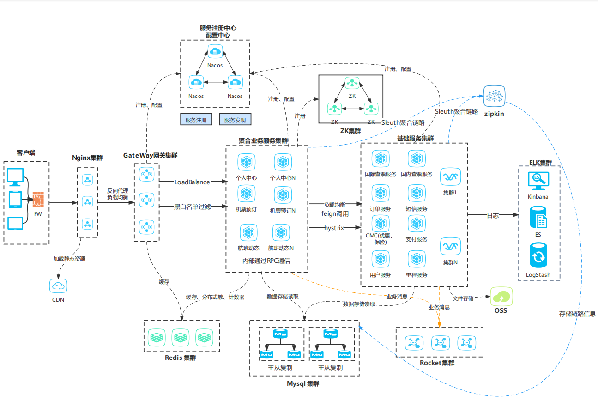
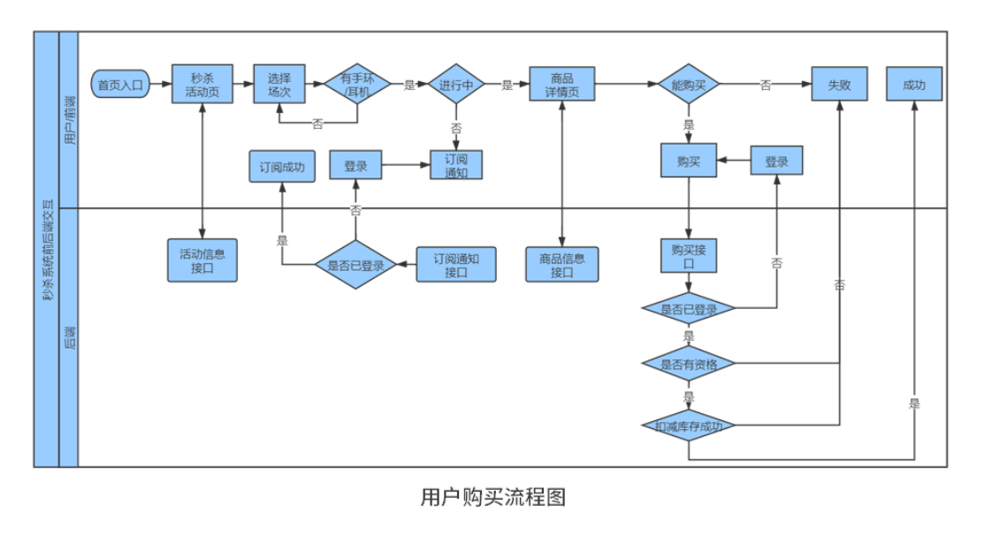
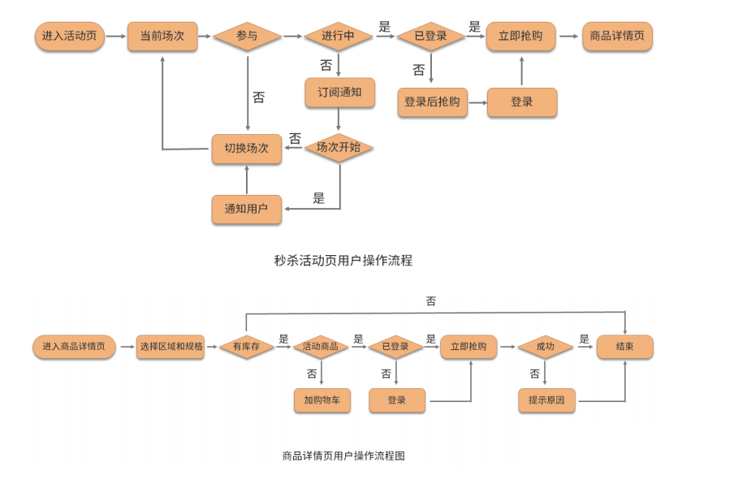
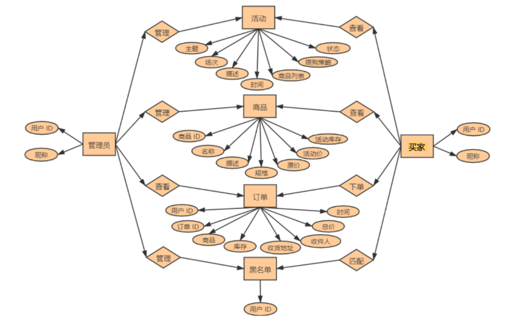
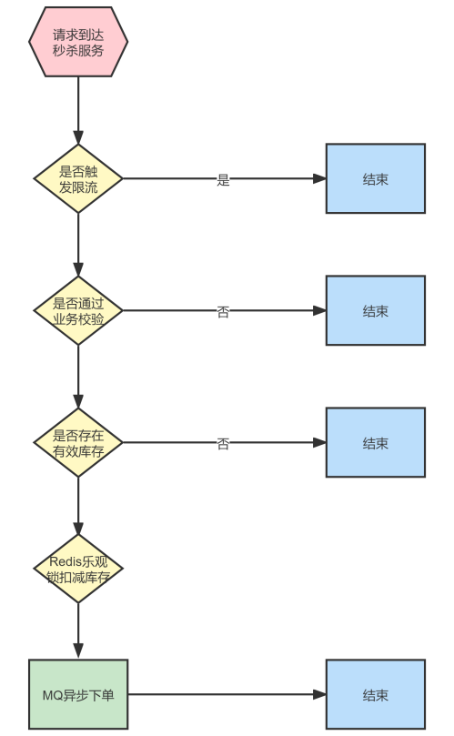
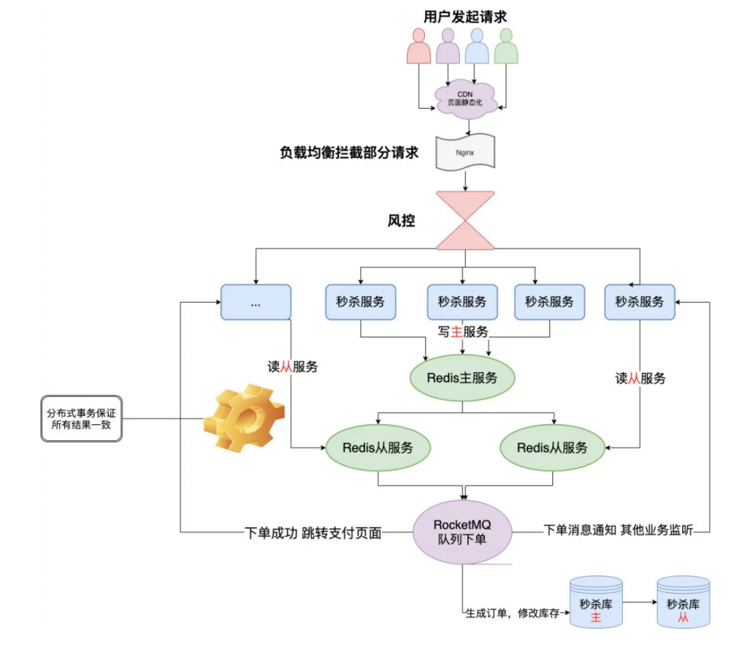
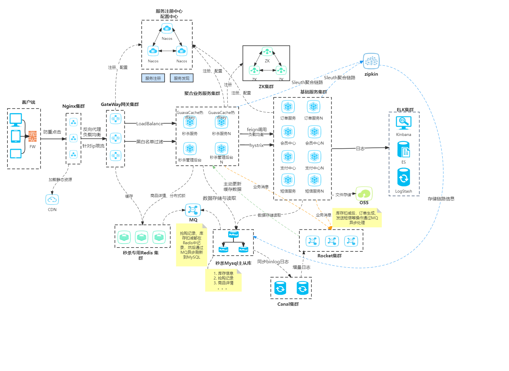

## 一、当前项目

### 1. 项目名称

某航空公司商务移动应用平台

### 2. 项目的业务背景

提供机票预订、行程管理、航班动态、个人中心等一站式服务的移动应用平台，支持APP、小程序、触屏等客户端，为客户带来更为优质的机票查询、订票、提前选坐、机票改签等服务

### 3. 项目的核心架构图

### 4. 你在该项目中的职责、任务？你所负责的部分用到了哪些技术？以及有哪些亮点？

我负责聚合业务服务中的，机票预订产品的开发。该产品下又细分机票查询、订单、支付等模块，技术选型为SpringBoot、SpringMVC、SpringCloud（Nacos、Feign、Hystrix、GateWay、Sleuth、Zipkin）、Redis、MySQL、RocketMQ、Motan

亮点：

- 用户支付成功后，支付服务通过异步回调机票预订的API，通知支付结果，再由机票预订服务通过Feign调用订单修改状态、短信服务发送短信、用户服务增加积分等业务，大量同步的网络调用极大的影响了系统的TPS。

  最终方案为，支付服务通过MQ分发消息，提高了系统性能。

- 采用GuavaCache替代ConcurrentHashMap作为本地缓存

- 机票预订流内部服务之间的通信由原来的Feign的HTTP协议通信，改为了更为轻量级的RPC框架Motan

### 5. 相关数据指标、性能指标要求？具体是什么？

> 高性能：查票、下单和支付业务，对于TP90指标 要求为 <600ms
>
> 高可用：>99.9%
>
> 高并发：查票QPS > 50W，订单业务的TPS >5000

## 三、流量高峰-秒杀场景

### 1. 秒杀系统功能需求

#### 特性

- 时间短
- 库存少
- 并发高

#### 业务流程图

#### 前端交互逻辑

#### 后端需求分析

- 秒杀活动页需求的秒杀活动信息列表的接口，活动开始时间、结束
- 时间、商品列表。对应提醒按钮需求的Push订阅接口
- 对应商品详情页需求的商品活动接口信息
- 对应秒杀按钮需求的秒杀抢购接口
- 获得商品信息，对接商品中心
- 商品库存信息，对接库存中心
- 抢购生成订单，对接交易中心

#### 管理后台需求

- 活动场次信息管理：场次时间、商品种类
- 活动商品信息管理：商品数量、种类、型号、折扣等
- 缓存管理

#### 非功能需求

非功能需求是**系统在特定条件下正常运行的最低要求**。在系统的设计之初，我们就应当给这些最低要求赋予明确的定义，**给出明确的指标**，为了分析，可将影响要素分为与系统运行环境有关的**内部因素与系统运行环境无关的外部因素**

- 高可用指标，如，可用性方面要高于 99.99%
- 高性能指标，如，高性能方面要求请求延迟小于 200ms（TP90 200ms）
- 高并发指标，如，高并发方面要求QPS 大于 10万，订单TPS达到20000
- 安全防护能力
- 运营/运维成本

#### E-R图

### 2. 秒杀系统架构设计

#### 面对的挑战

- 对现有的**业务冲击**

  秒杀**拆分为独立服务**（也包括页面）

- 高并发下的**服务和数据库的压力**

  - **多级缓存**，CDN存储大量静态资源，本地缓存热卖商品详情，Redis分布式缓存非热卖商品详情。缓存一致性可采用主动更新策略：数据库更新，canal发送增量日志到MQ，消费者更新缓存数据

  - **限流**，将请求拦截在系统上游（有效请求非常低的情况）

  - 数据库**使用分库分表和读写分离**

- 突然增加网络和服务器的带宽

  升级出口带宽

- **库存超卖**

  - **使用Redis watch机制的乐观锁**
  - 分布式锁
  - **数据更新到Redis**（库存判断及扣减等操作需要使用Lua脚本完成，保证操作的原子性隔离性），然后将消息写入MQ，**异步更新数据库**

- 订单超时

  若业务要求超时订单**尽量准时自动取消**，则可利用MQ的**延时队列和死信队列**。将订单放入延时队列，设置延时时间，时间一到调用死信交换器将消息放入死信队列，然后将死信队列的订单进行回滚操作

#### 架构设计

前端层

- 秒杀页面展示
- 倒计时，与时间服务器同步时间，未到点不可点击
- 请求拦截，防止重复大量点击

站点层

- 页面的静态资源则走CDN

- 根据uid、ip进行一定规则的限流

服务层

- 商品详情等信息读缓存，当数据库商品信息修改，则通过 canal->MQ 更新缓存数据
- 库存扣减、生成订单（以下根据业务场景二选一）
  - **库存扣减走缓存**，然后发布消息到MQ**异步更新到数据库**，订单生成调用订单服务
  - 通过**悲观锁或者乐观锁控制库存扣减**，防止超卖

#### 进攻与防守

- **一个账号**发起**大量并发请求**

  如领取奖励的逻辑，高并发的场景下，一个请求领取积分成功然后修改数据库记录，此时在这之间该用户还有上百个该请求，绕过了判断逻辑，重复领取积分

  使用Redis分布式锁，或者使用Redis事务watch的乐观锁特性

- **大量“僵尸账号”**发起**大量并发请求**

  检测IP请求频率，对其进行限流或者使用验证码防爬

- **大量“僵尸账号”**发起**不同IP**的**大量并发请求**

  这些人通过随机IP代理服务，发起大量不同ip的请求。只能通过设置业务门槛（如限制用户等级、活跃度、资料完善度等），来解决掉这部分的流量攻击
