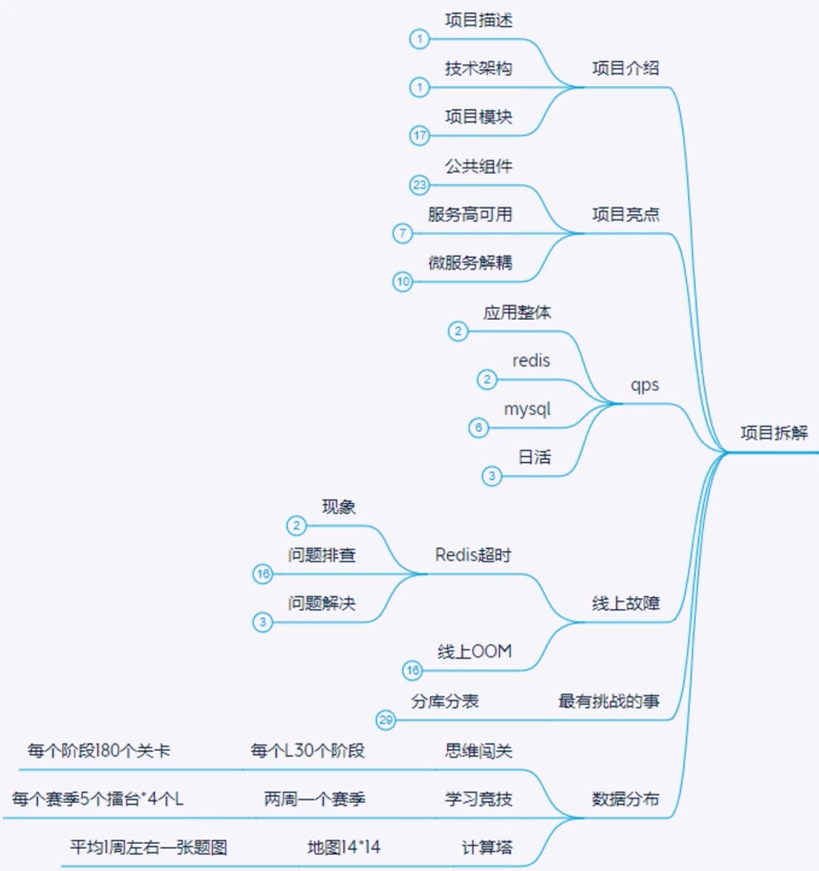
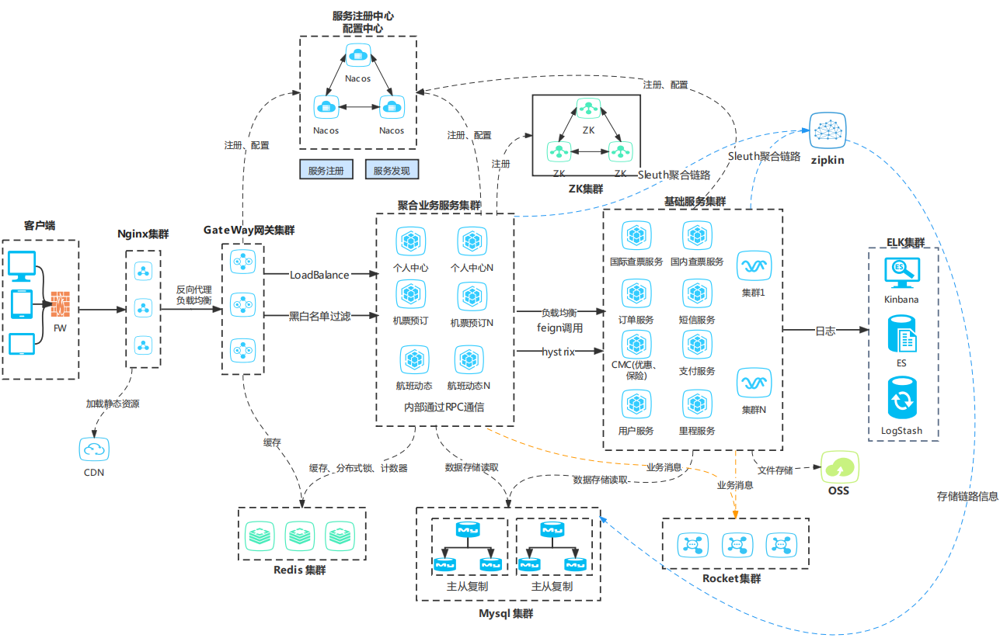
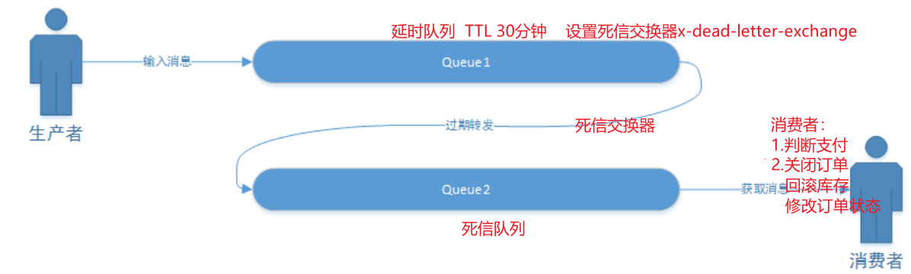
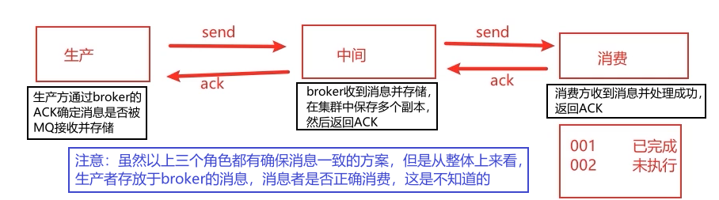

[toc]

## 一、当前项目

### 1. 项目名称

某航空公司商务移动应用平台

### 2. 项目的业务背景

移动互联网盛行的背景下，南方航空为了全面实施数字化转型、打造世界一流航空运输企业，旨在通过南方航空开发运营的移动端应用，为旅客提供更优质、便捷的购票服务。客户端支持APP、小程序、触屏，提供机票预订、行程管理、航班动态、权益中心、旅游度假等服务，基础服务包括票价中心、国内航班服务、订单中心、支付中心、营销中心、风控中心、常客中心、通知中心等。

### 3. 项目的核心架构图

**整体架构**

**权益中心服务**

1. 接入层
   1. Openrestry + keepalived 高可用负载均衡集群（lua预热脚本、静态资源存储CDN或者OSS）
   2. API 网关（统一JWT认证、流量拦截、负载均衡）
2. 服务层
   1. 采用分层架构，微服务治理采用SC的一些组件（Nacos服务发现和配置中心、Feign远程调用、Histrix熔断降级、Sleuth聚合链路追踪+Zipkin、）以及RPC通信框架
   2. 业务服务层（内部使用RPC通信，调用基础服务使用Feign通信）
   3. 基础服务层（基础服务只提供上游业务系统使用）
3. 缓存层
   1. Redis（Cluster + 主从哨兵）
   2. GuavaCache（本地缓存）
4. 存储层
   1. Mysql（主从 + 热备 + 分库分表）
   2. （ES）（复杂查询）
   3. 阿里OSS服务
5. 各个中间件
   2. ZK（如ES、Canal、RPC的服务注册与发现）
   3. MQ（消息分发、异步解耦削峰）
   4. Canal（数据同步）
   5. ELK（分布式日志）
   5. 普罗米修斯监控埋点（服务埋点）

### 4. 你在该项目中的职责、任务？你所负责的部分用到了哪些技术？以及有哪些亮点？

我负责聚合业务服务中的，机票预订产品的开发。该产品下又细分机票查询、订单、支付等模块，技术选型为SpringBoot、SpringMVC、SpringCloud（Nacos、Feign、Hystrix、GateWay、Sleuth、Zipkin）、Redis、MySQL、RocketMQ、Motan

##### 亮点1：针对会员日订单支付状态延时问题，给出了解决方案，提升了用户体验。

- 描述

  用户支付成功后，**支付服务通过异步回调我们的接口**，通知我们支付结果。我们对回调参数进行解密验签和解析，校验支付结果和当前订单状态，然后**调用订单服务修改状态**、**通知服务发送短信**、**用户服务增加积分**。异步回调接口中有大量同步业务的处理以及频繁的网络IO，导致接口的TPS较低，当流量高时，有部分用户的支付状态同步过长。

- 解决方案

  将同步调用订单服务、短信服务、历程积分服务的流程，改为MQ异步分发消息的技术方案，由各基础服务异步消费。并且回调接口只保留调用订单状态作为兜底方案。最终极大地

##### 亮点2：针对2020年疫情期间国际票价大涨，出现大量异常流量，进行了有效限流和拦截

- 描述

  系统监控日志发现流量异常（查票接口有规律的5-6W的QPS），定位到应该是有黄牛使用爬虫程序恶意扣票。就是订票不支付，然后在订单超时之前自动取消订单同时又将这张票订下。他们有很多个账号，之前好像检测中的有几百个了，交替反复的进行上述操作，大概5到6账号维护一张票，规避了系统针对单个账号频繁订票的防占座机制。同时发现还有大批量异常活动的IP，即使经过nginx限流依然还能保持2k+的额外qps，并且经常变更请求的频率。

- 解决方案

  我们在网关层增加了拦截策略

  - 针对读服务，**IP和账号**请求频率可疑的，一小时内超过100次的，提高限流阈值为10分钟一次。（由于nginx限流后单个ip不超过2~3个每秒，所以没必要使用setnxex锁。直接exist然后setex或incr即可）

    这次操作直接降低大部分读服务的异常流量，一天的PV直接降低5000W~6000W

  - 分析账号行为，针对订票和退票的请求频率超过6次每3小时的，弹出验证码进行人机识别。

  - 针对订票的接口，IP请求频率可疑的，无法发现。因为谁也不知道什么时候有票，对方也只有读到有票时才并发去抢票。并且扣票的话完全可以10分钟一次

##### 亮点3：针对付费权益包下单出现超卖，经排查分析没做好并发控制，给出了解决方案

- 描述

  上线开放PLUS窗口发售权益包（PLUS会员年卡包、机票权益包、套餐权益包等），其中包含很多权益项（如机票券、行李券、休息室、酒店优惠）。发现后台有一些热门的权益包出现了超卖现象。

- 分析

  日志排查发现某超卖权益包的下单TPS的峰值有400+，肯定是并发控制没做好。查看接口，是否允许重复购买判断、是否超出可购买数量、是否有未支付订单等校验后，然后库存判断和扣减并没做好并发控制，只是判断库存如果小于一则提醒卖完了。
  
- 解决方案

  方案有1.数据库表字段添加非负约束、2.使用分布式锁+自旋等待、3.购买记录和库存扣减走Redis、4.分库分表分散单库写压力。最终选择了Redis乐观锁来处理超卖，设置一个权益包key在Redis里作为锁标志，

##### 亮点4：针对一些用户拥有大量同批次优惠券，经排查没做好并发控制，导致重复领取，给出了解决方案。

> ##### 暂不考虑
>
> ##### 亮点5：线上某业务预测后续将面临十倍的流量 ，由原来的1300QPS提升到15000QPS。服务实例12台，接口：RPC调用下游 3个接口并处理业务，然后写数据库。
>
> - 压测观察硬件指标       
>   - **发现WEB容器内存CPU指标都没达到瓶颈，往上调整了线程池、连接池，充分利用了硬件资源。   400+ --->  700+**
>   - 若硬件指标达到瓶颈，则在线上进行水平扩容。
>
> - 读业务的提升
>   - 多级缓存
>
>     **对其中两个时效性不高的接口数据做缓存，并设置一个合理的TTL值。另一个接口设置较短的TTL 1秒。单机QPS 由100+ ---> 400+**
>   
> - 写业务的提升
>   - 使用FIFO先进先出队列，如MQ来异步、削峰，到达高吞吐量。缺点是业务需要接受异步场景
>   - 记录写Redis，然后通过MQ异步消费，Redis就天然满足高并发。缺点是需要保证Redis的高可用
>   - **发现数据库已经达到瓶颈，简单SQL优化空间很小，考虑对表进行分库分表。   700+ ---> 1500+**
>   - 若后续还要达到几十万的写TPS，除了分库分表，还可以弹性伸缩、扩机房、不同城市异地多活。
>

### 5. 相关数据指标、性能指标要求？具体是什么？

会员人数达到 6000W+

PV峰值 2000W+

查票峰值QPS 10W+

高性能：查票和下单业务，TP90指标 要求为 <600ms

高可用：>99.9%

高并发：查票QPS > 50W，订单业务的TPS >2000

## 二、实现高并发功能-秒杀

### 1. 秒杀系统功能需求

#### 特性

- 时间短
- 库存少
- 并发高

#### 业务流程图

#### 前端交互逻辑

#### 后端需求分析

- 秒杀活动页需求的秒杀活动信息列表的接口，活动开始时间、结束
- 时间、商品列表。对应提醒按钮需求的Push订阅接口
- 对应商品详情页需求的商品活动接口信息
- 对应秒杀按钮需求的秒杀抢购接口
- 获得商品信息，对接商品中心
- 商品库存信息，对接库存中心
- 抢购生成订单，对接交易中心

#### 管理后台需求

- 活动场次信息管理：场次时间、商品种类
- 活动商品信息管理：商品数量、种类、型号、折扣等
- 缓存管理

#### 非功能需求

非功能需求是**系统在特定条件下正常运行的最低要求**。在系统的设计之初，我们就应当给这些最低要求赋予明确的定义，**给出明确的指标**，为了分析，可将影响要素分为与系统运行环境有关的**内部因素与系统运行环境无关的外部因素**

- 高可用指标，如，可用性方面要高于 99.99%
- 高性能指标，如，高性能方面要求请求延迟小于 200ms（TP90 200ms）
- 高并发指标，如，高并发方面要求QPS 大于 10万，订单TPS达到20000
- 安全防护能力
- 运营/运维成本

#### E-R图

### 2. 秒杀系统架构设计

#### 2.1 面对的挑战

##### 2.1.1 对现有的业务冲击

秒杀**拆分为独立服务**（也包括页面）

##### 2.1.2 高并发下的服务和数据库的压力

- **多级缓存**，CDN存储大量静态资源，本地缓存热卖商品详情，Redis分布式缓存非热卖商品详情。缓存一致性可采用主动更新策略：数据库更新，canal发送增量日志到MQ，消费者更新缓存数据

- **限流**，将**写请求拦截在系统上游**（有效请求非常低的情况）

- 数据库**使用分库分表和读写分离**

##### 2.1.3 怎么防止库存超卖

- 库存少，有效请求少

  - 通过**分布式锁控制库存扣减**，**降低**数据库**行锁竞争压力**并且**防止超卖**；

- 库存多，需要吃下大部分请求

  - **库存扣减、秒杀记录走缓存**（库存判断及扣减等操作需要使用Lua脚本完成，保证操作的原子性隔离性），然后发布消息到MQ**异步更新到数据库**，订单生成调用订单服务、营销服务扣减优惠券、短信服务发送短信。

    **缺点：**若**Redis挂了重启，则可能会造成部分数据的丢失**。此时必然需要将库存从数据库中**重新加载到Redis中**，而此时数据库**消费了MQ中的扣减记录，造成Redis中的库存大于数据库**，可能导致超卖。

  - 请求走MQ，异步、削峰处理写请求，前提是业务需要接受这种异步的处理

  - 将库存进行分片到多个库中。然后通过uid进行路由到对应库存库，监控库存剩余5%时，将分片回收到主片中。并且由分布式事务来控制主片和分片的库存回收。

##### 2.1.4 如果使用了缓存，还需要注意：

- **缓存与数据库的一致性**

  - 主动更新

    更新数据库后，通过Canal中间件将binlog日志采集发送到MQ中，然后更新缓存

  - 被动更新

    被动或主动删除缓存（设置缓存key的ttl 或者 写数据库时删除缓存），然后在**读时，查数据库回填数据到缓存**，这属于被动更新

    **注意：**针对热点Key的高并发场景，采取**延时双删策略**。读时可能造成**缓存击穿**，可以采用**分布式锁控制一个请求去查库**，剩余请求**阻塞等待缓存更新，可设置等待超时时间**

- **怎么防止缓存雪崩、缓存击穿、缓存穿透的**

- 如果有**事先未预料到的商品突然成为热点，流量突然激增**，有什么应急措施。

  应急措施：对该商品的**限流阈值往下调（高并发系统必然有多种限流机制）**。

  正确做法：通过大数据的流式计算平台，如Flink对商品访问次数进行实时统计。当达到某个阈值时，进行**自动限流**，并将该商品**加载到本地缓存**，并开启主动更新策略或被动更新策略，**然后解除限流**

##### 2.1.5 订单未支付怎么及时取消

若业务要求超时订单**尽量准时自动取消**，则可利用MQ的**延时队列和死信队列**。将订单放入延时队列，设置延时时间，时间一到调用死信交换器将消息放入死信队列，然后将死信队列的订单进行回滚操作

##### 2.1.6 如果使用MQ，还需要注意：

- 消息丢失，消息重复消费（幂等性）

  虽然MQ自身有机制来保证各环节的消息一致性，防止消息丢失和消息重复。但网络传输总会有问题，生产方无法确保消息是否被消费方消费。

  解决方案：创建一个消息表，使用递增的全局唯一分布式ID对消息编号并标识状态。可以防止消息丢失和重复

  

- 消息积压

  中间件如Kafka和rocket单机TPS可达几十万每秒，所以瓶颈在于消费端。若突发积压，可扩容消费者实例数量。后续再排查原因，是否有硬件问题、网络问题、代码逻辑问题

##### 2.1.7 下游接口性能问题，如何降级处理

下游接口出现异常，可采用**有损、异步的降级处理方案**

- 比如库存扣减接口异常，可先生成订单，但是提醒用户正在出库，但是有可能无库存需要排队
- 比如视频/文章风控校验接口异常，可先发布但只能自己看，通过异步方式进行校验（如MQ分发、人工等）

##### 2.1.8 进攻与防守

- **一个账号**发起**大量并发请求**

  如领取奖励的逻辑，高并发的场景下，一个请求领取积分成功然后修改数据库记录，此时在这之间该用户还有上百个该请求，绕过了判断逻辑，重复领取积分

  使用Redis分布式锁，或者使用Redis事务watch的乐观锁特性

- **大量“僵尸账号”**发起**大量并发请求**

  检测IP请求频率，对其进行限流或者使用验证码防爬

- **大量“僵尸账号”**发起**不同IP**的**大量并发请求**

  这些人通过随机IP代理服务，发起大量不同ip的请求。只能通过设置业务门槛（如限制用户等级、活跃度、资料完善度等），来解决掉这部分的流量攻击

#### 2.2 架构设计的实现

结合上述的面对挑战，现在将整个链路从前端后数据库做出总结

##### 2.2.1 前端层

- 秒杀页面展示。
- 倒计时，与时间服务器同步时间，未到点不可点击。
- **请求拦截，防止重复大量的写请求。**

##### 2.2.2 站点层

- **页面的静态资源走CDN**
- **首页的数据**（广告、热销、推荐）通过OpenRestry的**Lua脚本加载预热缓存**，由数据库加载到分布式缓存和Nginx缓存中。数据一致性由主动更新策略来保持（改库 ---> Canal  --->  MQ --->  同步服务  --->  执行脚本冲洗加载数据）
- 根据ip频率和账号uid的请求次数进行**限流**，验证码来人机识别

##### 2.2.3 服务层

- 商品详情等信息**读缓存**，当数据库商品信息修改，则通过 canal->MQ 更新缓存数据。

- 库存扣减、生成订单（以下根据业务场景二选一）

  - 库存少，有效请求少

    - 通过**分布式锁控制库存扣减**，**降低**数据库**行锁竞争压力**并且**防止超卖**；

  - 库存多，需要吃下大部分请求

    - **库存扣减、秒杀记录走缓存**（库存判断及扣减等操作需要使用Lua脚本完成，保证操作的原子性隔离性），然后发布消息到MQ**异步更新到数据库**，订单生成调用订单服务、营销服务扣减优惠券、短信服务发送短信。

      **缺点：**若**Redis挂了重启，则可能会造成部分数据的丢失**。此时必然需要将库存从数据库中**重新加载到Redis中**，而此时数据库**消费了MQ中的扣减记录，造成Redis中的库存大于数据库**，可能导致超卖。

    - 请求走MQ，异步、削峰处理写请求，前提是业务需要接受这种异步的处理

    - 将库存进行分片到多个库中。然后通过uid进行路由到对应库存库，监控库存剩余5%时，将分片回收到主片中。并且由分布式事务来控制主片和分片的库存回收。

- RPC调用下游接口，需要做好降级处理。比如有损的降级处理，先降级响应，后处理

##### 2.2.4 数据库层

若库存够多，考虑数据库做分库分表 + 读写分离，若需要吃下百万的QPS，考虑多机房、异地多活

## 三、现系统QPS提升十倍

#### 寻找瓶颈

首先压测，找到系统瓶颈，是硬件资源、还是应用服务、还是下游基础服务、还是缓存架构、还是数据库

#### 服务器瓶颈

- 若硬件资源被打满，如CPU、内存被打满，可考虑进行服务器扩容。但考虑到成本问题，可先放一放，往后看
- 若没有被打满，则可调整Web容器的线程池和连接池，往上调一调

#### 应用服务

首先要考虑是读业务还是写业务

- 先看**压测的性能指标**，如接口QPS、GC情况（吞吐量、GC频率、GC时间）如果GC频繁、GC耗时久、**对JVM调优**

- 其次再看，如果是**读业务**
  - 考虑使用多级缓存，并且确保本地缓存、分布式缓存、数据库数据一致性。如应用首页的数据，使用OpenRestry加载Lua脚本预热数据。
- 其次再看，如果是**写业务**
  - 使用**FIFO先进先出队列，如MQ**来异步、削峰，到达高吞吐量。缺点是业务需要接受异步场景
  
  - **记录写Redis，然后通过MQ异步写入数据库**，Redis就天然满足高并发。缺点是需要保证Redis的高可用
  
  - **发现数据库已经达到瓶颈，简单SQL优化空间很小，考虑对表进行分库分表。   700+ ---> 1500+**
  
    若后续还要达到几百万的写TPS，除了分库分表，还可以**弹性伸缩、扩机房、不同城市异地多活**。

#### 下游基础服务

下游基础服务的性能也将影响业务系统的QPS，所有当下游基础服务出现异常，可以做一些有损的降级处理

- 比如库存扣减接口异常，可先生成订单，但是提醒用户正在出库，但是有可能无库存需要排队
- 比如视频/文章风控校验接口异常，可先发布但只能自己看，通过异步方式进行校验（如MQ分发、人工等）

#### 缓存中间件

- 分布式缓存架构保证高可用高扩展。

- 本地缓存选好Guava Cache。

- 保证缓存与数据库数据的一致性

#### 数据库

- 优化SQL

- 若SQL不是瓶颈，则瓶颈在于数据库架构，升级为分库分表 + 读写分离
- 多维度的复杂查询，走ES。使用Canal同步Binlog实现数据一致性
