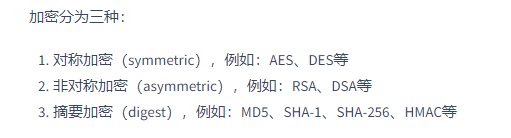

#### 场景介绍:
##### 在互联网交互中，网络传输中的数据是可以被不法分子截取到的。显然，涉密的数据不应该以明文的方式在网络中传输，如：支付传输的报文信息。

			

#### 常见的加密算法：
- BASE64：编码方式（8位字节代码），二进制与字符串相互转换 
- MD5：Message-Digest Algorithm（消息摘要算法第五版）
    - 散列函数（哈希算法）
    - 不可逆，压缩性
- DES：Data Encryption Standard（数据加密标准）
    - 对称加密 
    - 同一个SK
- AES：Advanced Encryption Standard（高级加密标准）
    - 对称加密 
    - 一个SK扩展成多个子SK，轮加密
- RSA
    - 非对称加密，即：PK与SK不是同一个 
    - PK用于加密，SK用于解密
    - PK决定SK，但是PK很难算出SK（数学原理：两个大质数相乘，积很难因式分解）
    - 速度慢，只对少量数据加密

​	JAVA中有很多加密工具类，**如apache的DigestUtils、hutool的SecureUtil**