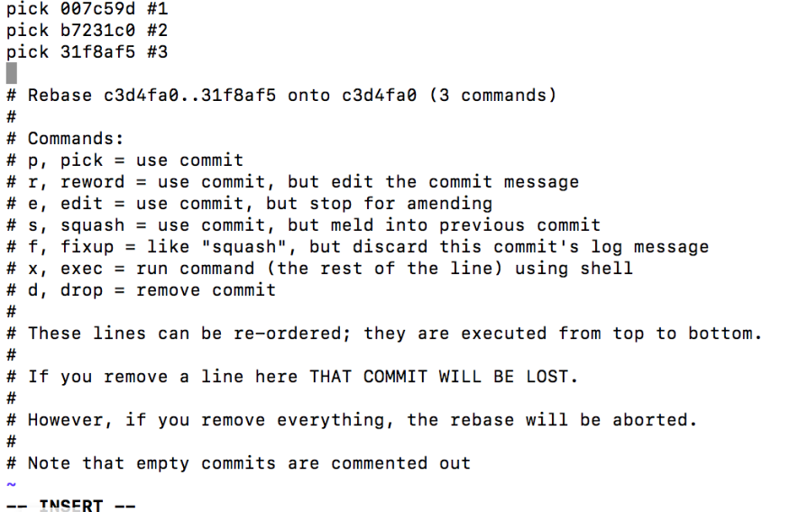

##### 克隆


```SH
git clone url
```


##### 标签

`-a` 选项意为”创建一个带注解的标签”。 不用 `-a` 选项也可以执行的，但它不会记录这标签是啥时候打的，谁打的，也不会让你添加个标签的注解。 我推荐一直创建带注解的标签。

```sh
git tag -a v1.0.0
```


##### 查看/修改用户名、邮箱


```sh
#查看
$ git config --global -l
$ git config user.name
$ git config user.email

#修改
$ git config --global user.name "username"
$ git config --global user.email "email"
```


##### 使用代理

```sh
git config --global http.proxy http://127.0.0.1:1080
git config --global https.proxy http://127.0.0.1:8080
```


##### 取消代理

```sh
git config --global --unset http.proxy
git config --global --unset https.proxy
```


##### 查看/添加远程仓库

```shell
#查看当前项目远程仓库
git remote
origin

#查看当前项目远程仓库地址
git remote -v
origin  https://github.com/gozhuyinglong/blog-demos.git (fetch)
origin  https://github.com/gozhuyinglong/blog-demos.git (push)

#重命名远程仓库
git remote rename <old_remote> <new_remote>
git remote rename origin github

#修改远程地址
git remote set-url <remote> <url>

#添加远程仓库
git remote add <remote> <url>
git remote add gitee https://gitee.com/gozhuyinglong/blog-demos.git

#拉取及推送
git push <remote> <branch>
git pull <remote> <branch>

git pull github master
git push github master
git pull gitee master
git push gitee master

#移除远程仓库
git remote remove <remote>
git remote remove gitee
```


##### 将某分支的某commit代码合到另一个分支

```sh
git branch -a #查看本地和远程所有分支
git checkout -b feature/test remotes/origin/feature/test #从远程分支创建并切换到新的本地分支

git branch #查看本地分支
git checkout feature/test #切换到本地分支feature/test

#将另一个分支指定commit-id合并到本地分支，00940ac970b9ddab63bff928479668bbfa293aaf是另一个分支的commit-id，也可以用空格分离多个commit-id批量提交
git cherry-pick 00940ac970b9ddab63bff928479668bbfa293aaf 

git log #查看本地分支是否有添加的提交记录

git pull #拉取最新代码

git push -f #推送到远程仓库
```


##### 回退local及remote 到某个版本

```sh
git reset --soft HEAD ~1 #回滚到上一次commit版本
git reset --soft HEAD ~2 #回滚到前两次commit版本
```

`--soft：`回退到某个版本，GIT暂存区和工作目录的内容不变，可以继续修改暂存区的代码。

`--hard：`回退到某个版本，GIT暂存区清空，完全回到某个版本的状态。

```sh
# 1. 查看历史提交记录
git reflog

# 2. n是命令1 查到的某个历史版本
git reset --hard HEAD@{11}
git reset --hard HEAD@{n}

# 3. push
git push -f
```


##### 删除远程某commit代码

需求：按最新时间顺序分别有commitA、commitB、commitC提交，现在要删除commitB

```sh
git log #获取commit信息 

#00940ac970b9ddab63bff928479668bbfa293aaf 是要删除commitB版本的前一次commitC的commit号 
git rebase -i  00940ac970b9ddab63bff928479668bbfa293aaf

编辑文件，将前面的pick改为drop，然后按照提示保存退出

git log #查看

git push -f #推送到远程仓库
```



