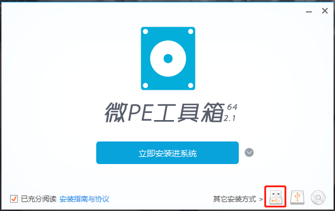
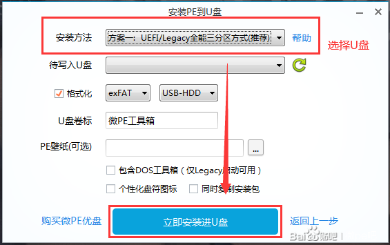

### 使用微PE工具箱制作pe系统盘

##### 1、下载工具箱
[进入微PE官网下载最新版工具箱](https://http://www.wepe.com.cn/download.html)，目前最新版为We_Pe2.1（Win10pe内核），经实践可正常安装Win7系统

##### 2、备份好U盘中的数据，安装PE将格式化U盘

##### 3、双击下载好的工具箱，将PE安装进U盘

##### 4、选择推荐安装方式及U盘

##### 5、准备系统镜像
系统镜像在[MSDN](https://msdn.itellyou.cn/)下载（MSDN中的系统都为微软官方纯净系统），下载几个需要的系统，放入制作好的PE盘中。

##### 6、准备万能网卡版的驱动精灵
网卡版驱动精灵[下载地址](http://www.drivergenius.com/wangka/)，安装包放入制作好的PE盘中
