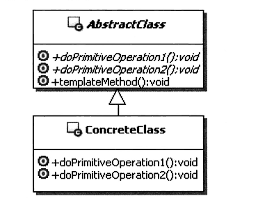

### 模板方法模式的结构



- AbstractClass：抽象类（只有一个），定义了算法骨架（框架、流程）和原语操作（方法），子类可通过重写定义这些原语操作来实现算法骨架中的一个步骤，也可通过直接使用这个抽象类提供的公共方法
- ConcreteClass：具体实现类（有多个），继承抽象类，重写了各个步骤的方法，完整该实现类相关的功能。

### 定义

定义一个操作中算法的骨架，而将一些步骤延迟到子类中。`TemplateMethod `使得子类可以不改变一个算法的结构即可重定义该算法的某些特定步骤。

其实Java的抽象类本来就是Template模式,因此使用很普遍.而且很容易理解和使用,我们直接以示例开始:

#### 案例

定义了骨架的抽象类

```java
public abstract class Benchmark {
　　/**
　　* 下面操作是我们希望在子类中完成
　　*/
　　public abstract void benchmark(); 

　　/**
　　* 重复执行benchmark次数
　　*/
　　public final long repeat (int count) {
      if (count <= 0){
          return 0;
      } else {
          long startTime = System.currentTimeMillis();

          for (int i = 0; i < count; i++) 
              benchmark();

          long stopTime = System.currentTimeMillis();
          return stopTime - startTime;
      }
	}
}

```

某个功能的具体实现

```java
public class MethodBenchmark extends Benchmark {
　　/**
　　* 真正定义benchmark内容
　　*/
　　public void benchmark() {

　　　　for (int i = 0; i < Integer.MAX_VALUE; i++){
　　　 　　System.out.printtln("i="+i);　 　　
　　　 }
　　}
}
```

